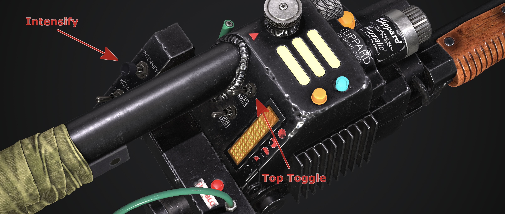
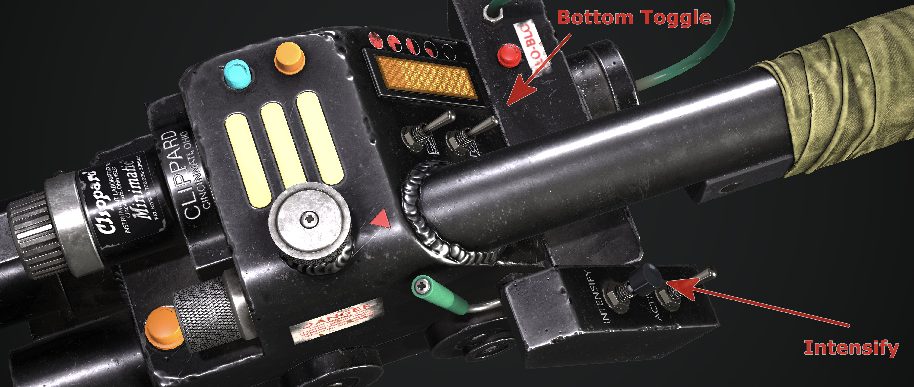

<h2> GPStar Proton Pack &amp; Neutrona Wand EEPROM System</h2>

# EEPROM Menus

There are two EEPROM menus available which can be accessed to adjust and save configurations onto either the Proton Pack and Neutrona Wand EEPROM memory. These are the **EEPROM LED Menu** and the **EEPROM Configuration Menu**.

⚠️ **NOTICE:** The EEPROM memory has a specified life of 100,000 write/erase cycles. You will generally not reach this limit in your lifetime, but if you did, it can be disabled to bypass it. Refer to the Advanced User Configurations below for more information.

## LEDs - Top Menu

The EEPOM LED Menu can be used to configure different LED setups for your Proton Pack. All changes can be saved directly to the Proton Pack EEPROM and will be loaded automatically even if you turn off the power to your devices.

To access the EEPROM LED Menu System, hold down the `Intensify Button` and toggle the right hand `Top Toggle` button 5 times (up and down). You will then hear a beep noise and your bargraph will light up to indicate you are in the EEPROM LED Menu System. The Neutrona Wand barrel and all the Proton Pack LEDs will light up to the default Spectral Custom colours when you enter the EEPROM LED Menu. Use the `Top Dial` on the top of the Neutrona Wand to navigate the menu system and options. When you reach a different menu level, the Slo-Blo LED and other lights on the Neutrona Wand will illuminate to indicate these menu levels, along with audio cues from the system.

	Menu Level 1 -> No additional wand lights will be illuminated
	Menu Level 2 -> Slo-Blo illuminated

📝 **Note:** EEPROM menus can only be reached while both the Neutrona Wand and Proton Pack are powered down.

### LED Menu - Level 1

| Option | Purpose | Intensify&nbsp;Button | Barrel&nbsp;Wing&nbsp;Button |
|:------:|---------|------------------|--------------------|
| 5️⃣ | Save or Clear the EEPROM settings | Clear all the LED settings in the Proton Pack and Neutrona Wand EEPROMs.  **The Proton Pack and Neutrona Wand will instead load the software defined defaults the next time you power-cycle from the battery.** | Save the current settings to the Proton Pack and Neutrona Wand EEPROMs. |
| 4️⃣ | Neutrona Wand Barrel LED Count Toggle&nbsp;/ Spectral Custom (Barrel) Colour | Toggle between 2, 5, 48 or 50 LEDs for your Neutrona Wand barrel. | `(Barrel Wing Button + Top Dial)` Changes the colour hue of the **Neutrona Wand barrel** for the Spectral Custom mode. |
| 3️⃣ | Power Cell LED Count Toggle&nbsp;/ Spectral Custom (Power Cell) Colour | Toggle between 13 or 15 LEDs for your Power Cell. | `(Barrel Wing Button + Top Dial)` Changes the colour hue of the **Power Cell** for the Spectral Custom mode. |
| 2️⃣ | Cyclotron LED Count Toggle&nbsp;/ Spectral Custom (Cyclotron) Colour | Toggle between 12, 20, 36 or 40 LEDs for your Cyclotron Lid. | `(Barrel Wing Button + Top Dial)` Changes the colour hue of the **Cyclotron** for the Spectral Custom mode. |
| 1️⃣ | Inner Cyclotron LED Count Toggle&nbsp;/ Spectral Custom (Inner Cyclotron) Colour | Toggle Between 12, 23, 24, 26, 35, or 36 LEDs for your Inner Cyclotron. | `(Barrel Wing Button + Top Dial)` Changes the colour hue of the **Inner Cyclotron** for the Spectral Custom mode. |

### LED Menu - Level 2

| Option | Purpose | Intensify&nbsp;Button | Barrel&nbsp;Wing&nbsp;Button |
|:------:|---------|------------------|--------------------|
| 5️⃣ | 1984/1989&nbsp;Cyclotron&nbsp;Fade&nbsp;Toggle&nbsp;/ Pack&nbsp;LED&nbsp;Brightness&nbsp;Adjustment | Toggle whether the outer cyclotron LEDs have a fade effect or not in 1984 and 1989 year modes. | `(Barrel Wing Button)` Toggles between Power Cell, Cyclotron, Inner Cyclotron, or Inner Cyclotron Switch Panel devices  `(Barrel Wing Button + Top Dial)` Increases/Decreases the selected device's LED brightness |
| 4️⃣ | Bargraph&nbsp;Segment&nbsp;Count&nbsp;Toggle&nbsp;/ RGB&nbsp;Vent&nbsp;Light&nbsp;Toggle | Toggle between 28 segments or 30 segments for the optional bargraph.1 | Enable/Disable the optional addressable RGB LED vent/top light board. |
| 3️⃣ | Power&nbsp;Cell&nbsp;Invert | Change the direction of the Power Cell animation. | `unused` |
| 2️⃣ | Inner&nbsp;Cyclotron&nbsp;LED&nbsp;Panel&nbsp;Toggle | Toggle the optional Inner Cyclotron LED Panel between disabled (individual LEDs), static colours (for prop-accurate coloured cliplite covers), and dynamic colours (for the LED panel with clear cliplite covers). | `unused` |
| 1️⃣ | Inner&nbsp;Cyclotron&nbsp;GRB&nbsp;Toggle | Toggle your Inner Cyclotron from RGB or GRB LEDs. | `unused` |

1 This setting will only take effect if you have an optional bargraph plugged into the i2c data port when the wand is first started.

## Configuration - Bottom Menu

The EEPROM Configuration Menu can be used to save certain behaviours of your Neutrona Wand and Proton Pack as the standard settings.

To access the EEPROM Configuration Menu, hold down the `Intensify Button` and toggle the right hand `Bottom Toggle` button 5 times (up and down). You will then hear a beep noise and your bargraph will light up to indicate you are in the EEPROM Configuration Menu System.

To access the EEPROM Configuration menus, use the `Top Dial` on the top of the wand. When you reach a different menu level, the Slo-Blo LED and other lights on the Neutrona Wand will illuminate to indicate these menu levels, along with audio cues from the system.

	Menu Level 1 -> No additional wand lights will be illuminated
	Menu Level 2 -> Slo-Blo illuminated
	Menu Level 3 -> Slo-Blo and vent light illuminated
	Menu Level 4 -> Slo-Blo, vent light, and top gun box light illuminated
	Menu Level 5 -> Slo-Blo; vent light, top gun box light, and front gun box light illuminated

📝 **Note:** EEPROM menus can only be reached while both the Neutrona Wand and Proton Pack are powered down.

Please note whatever settings you have temporarily changed in the regular menus and sub menus will be applied automatically and saved if you exit the EEPROM menu by saving the settings.

### Configuration Menu - Level 1

| Option | Purpose | Intensify&nbsp;Button | Barrel&nbsp;Wing&nbsp;Button |
|:------:|---------|------------------|--------------------|
| 5️⃣ | Save or Clear the EEPROM settings | Clear all the configuration only settings in the Proton Pack and Neutrona Wand EEPROMs.  **The Proton Pack and Neutrona Wand will instead load the software defined defaults the next time you power-cycle from the battery.** | Save the current settings to the Proton Pack and Neutrona Wand EEPROMs.  **It is advised to power-cycle your equipment after saving settings to ensure the proper defaults/values are loaded, such as the case of changing the System Mode.** |
| 4️⃣ | Firing&nbsp;Mode&nbsp;Selection&nbsp;/ Spectral&nbsp;Modes | Cycle through VG/CTS operation modes to set as your default.1 | Enable/Disable the Spectral Modes. |
| 3️⃣ | Overheating&nbsp;/ Smoke | Enable/Disable Overheating Ability | Enable/Disable Smoke Effects |
| 2️⃣ | Cyclotron&nbsp;LED&nbsp;Control | Cyclotron rotation direction. Clockwise or counter clockwise. | Enable/Disable the Cyclotron Lid Ring Simulation in Afterlife and Frozen Empire mode. ONLY applies to use of the 12, 20, or 36 LED hardware options. |
| 1️⃣ | Sound&nbsp;Effects | Enable/Disable extra Neutrona Wand sound effects to be played by the Proton Pack. | Enable/Disable the proton stream impact sound effects. |

1 Choose between Video Game and Cross the Streams (CTS) operation modes. The Cross The Streams modes are closer to what is seen in the films, while Video Game mode imitates behaviour seen in the 2009 Ghostbusters: The Video Game. Note that Video Game mode is only available in Super Hero mode.

### Configuration Menu - Level 2

| Option | Purpose | Intensify Button | Barrel Wing Button |
|:------:|---------|------------------|--------------------|
| 5️⃣ | Quick&nbsp;Vent&nbsp;/ Wand&nbsp;Boot&nbsp;Errors | Enable/Disable the Quick Venting feature. When enabled, you can manually vent your Proton Pack by pressing the Intensify button while the top right toggle switch is switched down.   📝 `Super Hero mode only` | Enable to disable the Wand boot error mode. When enabled, if you turn on the Neutrona Wand while the top right toggle is up and activated, the Neutrona Wand enters an error mode and remains locked out until the switches are all turned off.   📝 `Super Hero mode only` |
| 4️⃣ | Vibration&nbsp;Settings | Cycle through Proton Pack vibration options2 | Cycle through Neutrona Wand vibration options |
| 3️⃣ | Wand&nbsp;Beep&nbsp;Loop&nbsp;/ VGA&nbsp;Colour&nbsp;Mode&nbsp;Toggles | Enable/Disable the looping beep sound effect in Afterlife and Frozen Empire Mode. | Cycle through VG colour modes.3 |
| 2️⃣ | Overheat&nbsp;Lights | Enable/Disable the N-Filter LEDs from strobing during overheating. | Enable/Disable the Proton Pack lights to turn off during overheating. When disabled, after ramping down to a slower pace, the lights stay on.
| 1️⃣ | Default Year&nbsp;Mode&nbsp;/ Overheat&nbsp;Sync&nbsp;to&nbsp;Fan | Set your default year mode between 1984/1989/Afterlife/Frozen Empire/Default. When set, the system will ignore the year mode toggle switch during bootup. However the toggle switch can still be used while the Proton Pack is on. If set to Default, the system picks the year mode based on the position of the year mode toggle switch in the Proton Pack.4 | Enable/Disable the overheat sync to fan. When enabled, the fan connections in the Proton Pack will only activate at the same time as the smoke connections. When disabled, the fan connections activate slightly after the smoke connections which allows some build of smoke before the fans activate. |

2 See [Inner Cyclotron](CYCLOTRON_INNER.md) for more information on the motorised cyclotron modification for the Proton Pack.

3 Enables/disables the video game colour modes for the Proton Pack's Power Cell and Cyclotron lights. This only affects the pack when in Video Game mode, not for CTS modes, and offers the following states:

- Disable all the video game colours (Power Cell remains blue, Cyclotron remains red).
- Enable only the Power Cell LEDs to change colours (requires RGB Power Cell).
- Enable only the Cyclotron LEDs to change colours (requires RGB replacement such as a Neopixel ring).
- Enable both the Power Cell and Cyclotron to use video game colours.

4 If the Neutrona Wand is in standalone mode, this does nothing. To change the default year for a standalone Neutrona Wand, please see Menu Level 3 below.

### Configuration Menu - Level 3

| Option | Purpose | Intensify Button | Barrel Wing Button |
|:------:|---------|------------------|--------------------|
| 5️⃣ | System&nbsp;Default&nbsp;Volume&nbsp;/ Neutrona&nbsp;Wand&nbsp;Year&nbsp;Mode | `(Intensify + Top Dial)` Adjusts the default volume for the system. (Uses audio beeps for indication of volume.) | Set the year mode your Neutrona Wand operates in. Options are: 1984/1989/Afterlife/Frozen Empire and System Default. When set to System Default, the Neutrona Wand matches the same year mode as that the Proton Pack is in. |
| 4️⃣ | Invert&nbsp;Bargraph&nbsp;/ Bargraph&nbsp;Overheat&nbsp;Blinking | Toggles inverting of the bargraph in the Neutrona Wand (depending on installation orientation). | Enable/Disable the bargraph blink sequence during overheat. When enabled, the bargraph will blink and an error sound will play while overheating. When disabled, the bargraph will ramp down to off without error sounds while overheating. |
| 3️⃣ | Bargraph&nbsp;Animations&nbsp;/ Bargraph&nbsp;Firing&nbsp;Animations | Toggle between animation modes as default for the idle bargraph: **Super Hero**, **Bargraph Original**, or **System Default** **System Default** chooses the default animation based on the year mode and system mode. | Toggle between animation modes as default for the bargraph when firing: **Super Hero**, **Bargraph Original**, or **System Default** **System Default** chooses the default animation based on the year mode and system mode. |
| 2️⃣ | Demo&nbsp;Light&nbsp;Mode&nbsp;/ Cyclotron&nbsp;3&nbsp;LED&nbsp;Toggle | Enable/Disable the Demo Light mode. When enabled, the Proton Pack will automatically boot up as soon as the system has power. | Toggle between 1 LED or 3 LEDs in each cyclotron lens in 1984/1989 year mode. |
| 1️⃣ | System&nbsp;Mode&nbsp;/ CTS&nbsp;Override | Toggle between the available system operation modes: **Super Hero** or **Mode Original** | Toggle between options for default CTS mode: **1984**, **Afterlife**, or **System Default** System Default automatically chooses the CTS mode based on the current year mode of your system. |

### Configuration Menu - Level 4

Adjust the vent smoke duration during overheat events and overheat start delay for each wand power level.

| Option | Purpose | `Intensify Button + Top Dial` | `Barrel Wing Button + Top Dial` |
|:------:|---------|------------------|--------------------|
| 5️⃣ | Power&nbsp;Level&nbsp;5 | Smoke vent duration during overheat `Range: 2 to 60 seconds` `Default: 6 seconds` | Overheat start delay `Range: 2 to 60 seconds` `Default: 30 seconds` |
| 4️⃣ | Power&nbsp;Level&nbsp;4 | Smoke vent duration during overheat `Range: 2 to 60 seconds` `Default: 5 seconds` | Overheat start delay `Range: 2 to 60 seconds` `Default: 35 seconds` |
| 3️⃣ | Power&nbsp;Level&nbsp;3 | Smoke vent duration during overheat `Range: 2 to 60 seconds` `Default: 4 seconds` | Overheat start delay `Range: 2 to 60 seconds` `Default: 40 seconds` |
| 2️⃣ | Power&nbsp;Level&nbsp;2 | Smoke vent duration during overheat `Range: 2 to 60 seconds` `Default: 3 seconds` | Overheat start delay `Range: 2 to 60 seconds` `Default: 50 seconds` |
| 1️⃣ | Power&nbsp;Level&nbsp;1 | Smoke vent duration during overheat `Range: 2 to 60 seconds` `Default: 2 seconds` | Overheat start delay `Range: 2 to 60 seconds` `Default: 60 seconds` |

### Configuration Menu - Level 5

Toggles overheating ability and continuous smoke effects during firing for each wand power level. The continuous smoke effects will randomly activate for very short bursts while continuously firing for long periods.

#### ⚠️ WARNING

**Running your smoke devices for long periods can potentially damage them, and/or reduce battery life. Adjust these settings with caution and use at your own risk!**

| Option | Purpose | Intensify Button | Barrel Wing Button |
|:------:|---------|------------------|--------------------|
| 5️⃣ | Power&nbsp;Level&nbsp;5 | Enable/Disable Overheating `Default: enabled` | Enable/Disable continuous firing smoke effects `Default: enabled` |
| 4️⃣ | Power&nbsp;Level&nbsp;4 | Enable/Disable Overheating `Default: disabled` | Enable/Disable continuous firing smoke effects `Default: enabled` |
| 3️⃣ | Power&nbsp;Level&nbsp;3 | Enable/Disable Overheating `Default: disabled` | Enable/Disable continuous firing smoke effects `Default: enabled` |
| 2️⃣ | Power&nbsp;Level&nbsp;2 | Enable/Disable Overheating `Default: disabled` | Enable/Disable continuous firing smoke effects `Default: enabled` |
| 1️⃣ | Power&nbsp;Level&nbsp;1 | Enable/Disable Overheating `Default: disabled` | Enable/Disable continuous firing smoke effects `Default: enabled` |

## Advanced User Configurations

To modify defaults within the software rather than the EEPROM menus, please see the [Advanced Configuration](ADVCONFIG.md) guide.
