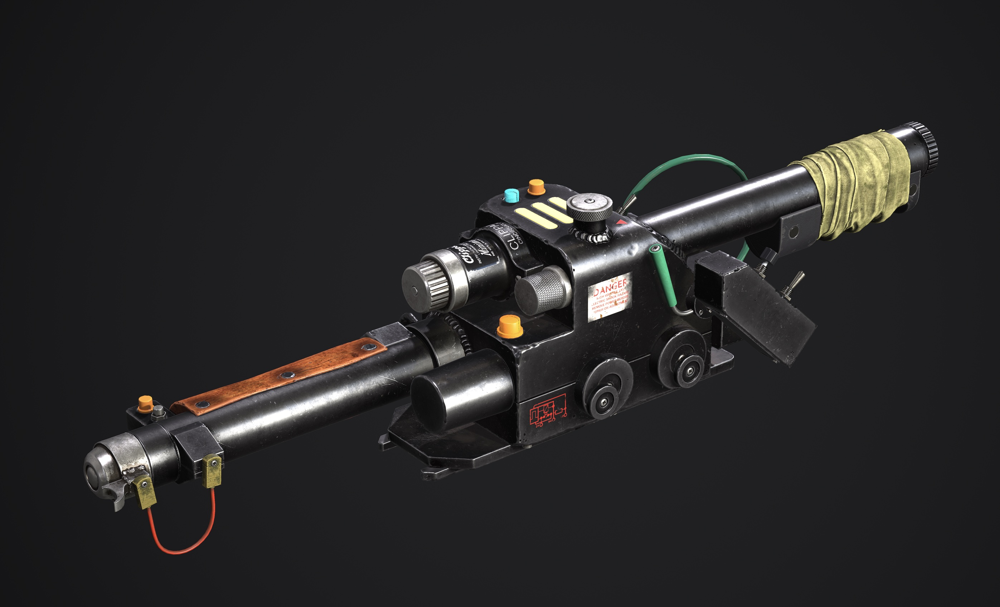
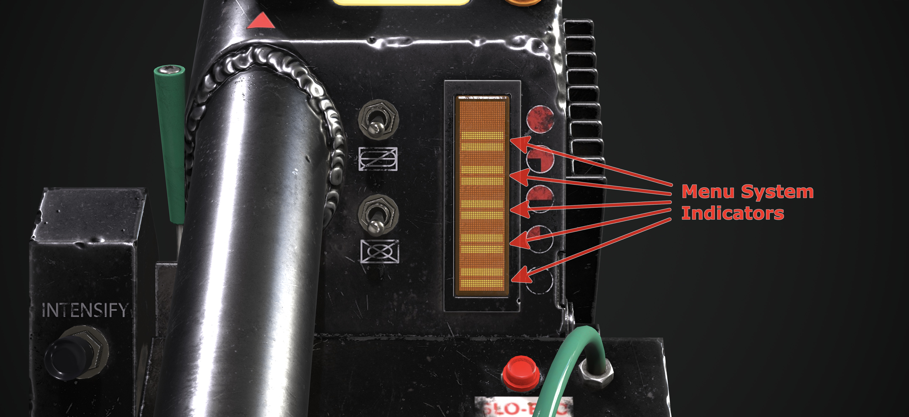
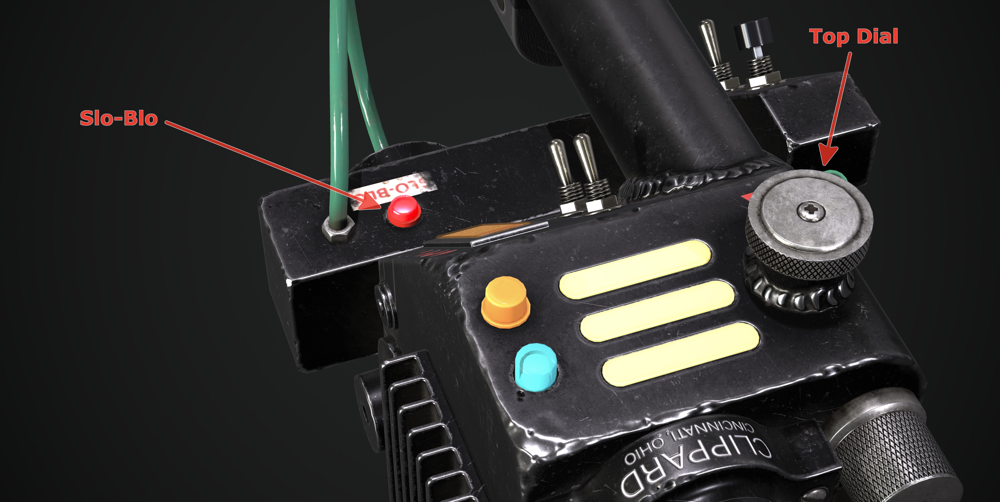

  

<h2> GPStar Proton Pack &amp; Neutrona Wand Operation Manual</h2>

Neutrona Wand renders courtesy of Luis Peña

# Operational Guide - Menu System

## Entering The Menu System

There are 2 ways to enter the Menu System.

- With any right-hand switch **DOWN**, press the `Barrel Wing Button` to enter the Neutrona Wand Menu System.  📝 `Super Hero mode only`

- While the Neutrona Wand and Proton Pack are powered down, press the `Barrel Wing Button`.

## Navigation

Use the `Top Dial` on the top of the wand to navigate up and down through the menu system.

When you are in the settings menu system the bargraph's 5 LEDs begin flashing (or 5 distinct segments when using the 28-segment or 30-segment bargraph). All other functions of the wand (such as firing) are temporarily disabled while in the menu system. There are 5 different menu settings, which are indicated by bargraph LED segments 1 through 5 (from bottom to top) with menu level 5 being the default upon entering this mode. For example in navigation, when 1 LED (or bargraph segment) is flashing/displayed that means you are on `Option 1`.

## Action Levels

Changes are made by pressing either the `Intensify` button on the gun box or the `Barrel Wing Button` at the end of the wand.

### Menu Level 1

| Option | Purpose | Intensify Button | Barrel Wing Button |
|:------:|---------|------------------|--------------------|
| 5️⃣ | Music&nbsp;Track&nbsp;Looping | Enable/disable looping of current track1 | Exit the menu system2 |
| 4️⃣ | Proton&nbsp;Pack&nbsp;Light&nbsp;Dimming | `(Intensify + Top Dial)` Increases/Decreases  the selected device's LED brightness | Toggles between Power Cell, Cyclotron, Inner Cyclotron, or Inner Cyclotron Switch Panel devices |
| 3️⃣ | Music & SFX Volume | `(Intensify + Top Dial)` Increases/Decreases SFX Volume | `(Barrel Wing Button + Top Dial)` Increases/Decreases Music Volume |
| 2️⃣ | Switch&nbsp;Music&nbsp;Track | Cycle forward in music queue | Cycle backwards in music queue |
| 1️⃣ | Play&nbsp;or&nbsp;Stop&nbsp;Music / System&nbsp;Mute | Start/stop music playback | Mute the Proton Pack and Neutrona Wand  or revert back to the previous volume3 |

1 Note that LED/segment #5 will stay solid when the single-track loop is enabled while in the top menu system; it will blink on/off when looping is disabled.

2 When you navigate back to `Option 5` and press the `Barrel Wing Button`, the wand will return to the previously-selected firing mode (if menu was entered while wand was on) or an idle state (if menu was entered while wand was off). Note that music will continue to play (and advance/loop) even when the pack and wand are turned off.

3 Note that LED/segment #1 will stay solid when the Proton Pack and Neutrona Wand volume is muted.

### Menu Level 2

📝 **Note:** The Neutrona Wand Menu Level 2 can only be reached while the Neutrona Wand and Proton Pack are both turned off.

To access Menu Level 2, use the `Top Dial` on the top of the wand to move down and past `Option 1` on Menu Level 1. When you reach the the next menu level, an audio cue will play and the Slo-Blo LED will light up to indicate this menu state.

| Option | Purpose | Intensify Button | Barrel Wing Button |
|:------:|---------|------------------|--------------------|
| 5️⃣ | Firing&nbsp;Mode&nbsp;Selection | Cycle through VG/CTS operation modes4 | Cycle through VG colour modes5 |
| 4️⃣ | Overheating / Smoke | Enable/Disable Overheating Ability | Enable/Disable Smoke Effects |
| 3️⃣ | Cyclotron&nbsp;LED&nbsp;Control | Change Cyclotron rotation direction | Toggle between 1 or 3 centered LEDs in the Cyclotron Lid for 1984/1989 modes |
| 2️⃣ | Vibration&nbsp;Settings | Cycle through Proton Pack vibration options6 | Cycle through Neutrona Wand vibration options |
| 1️⃣ | Year&nbsp;Mode&nbsp;Selection | Cycle through 1984, 1989, Afterlife, and Frozen Empire modes | Enable/Disable the Proton Stream impact sound effects |

4 Switch between Video Game and Cross the Streams (CTS) operation modes. Note that LED/segment #5 will stay solid when CTS or CTS Mix are enabled while in Menu Level 2. Note also that Video Game mode is only available in Super Hero mode.

5 Enables/disables the video game colour modes for the Proton Pack's Power Cell and Cyclotron lights. This only affects the pack when in Video Game mode, not for CTS modes, and offers the following states:

- Disable all the video game colours (Power Cell remains blue, Cyclotron remains red).
- Enable only the Power Cell LEDs to change colours (requires a RGB Power Cell).
- Enable only the Cyclotron LEDs to change colours (requires RGB replacements).
- Enable both the Power Cell and Cyclotron to use video game colours.

6 See [Inner Cyclotron](CYCLOTRON_INNER.md) for more information on the motorised cyclotron modification for the Proton Pack.

To exit the menu system, navigate to `Menu Level 1, Option 5` (Slo-blo LED is no longer illuminated) and press the `Barrel Wing Button`. A voice callout will be heard when transitioning between the top and sub menu levels.