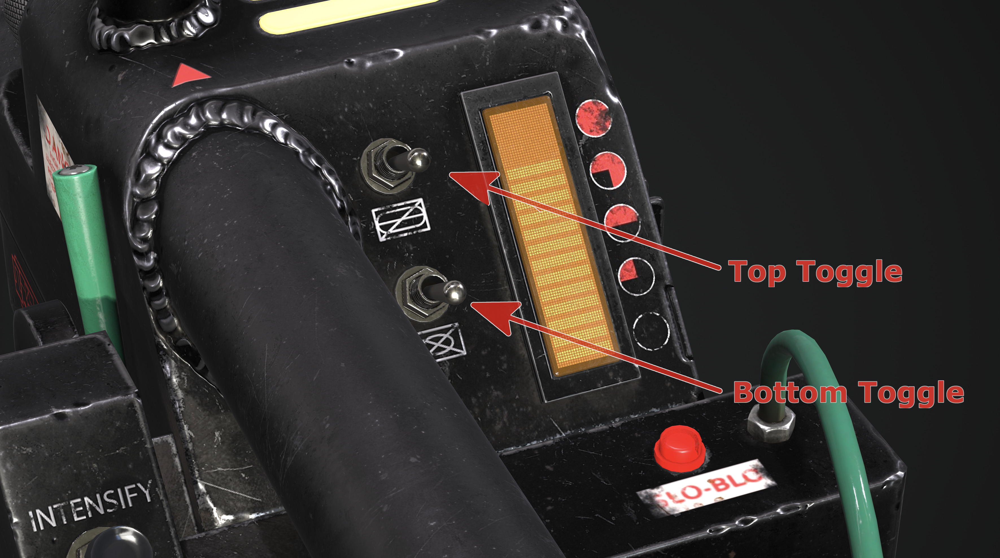

  

<h2> GPStar Proton Pack &amp; Neutrona Wand Operation Manual</h2>

Neutrona Wand renders courtesy of Luis Peña

# Operational Guide - General Usage

## Standard Features

- The switch underneath the Ion Arm can turn the Proton Pack on or off.
- You can run the pack without the Cyclotron Lid attached.
- The volume for the pack and wand can be controlled via the Crank Generator knob.
   - Clockwise to raise volume, counter-clockwise to lower it.
- When the ribbon cable is disconnected it will activate the alarm mode and degrade the Cyclotron spin.
- The Proton Pack can run without a wand, though it can only be activated via the switch under the Ion Arm.
- Vibration switch in the Cyclotron switch plate enables or disables the vibration motors for both the Proton Pack and Neutrona Wand.
- Theme toggle in the Cyclotron switch plate changes the Proton Pack and Neutrona Wand modes between 1984, 1989, Afterlife, and Frozen Empire.
- The Proton Pack vibrates only while firing. This can be changed to vibrate at all times or entirely disabled. Vibration can be enabled or disabled by the vibration toggle switch in the Proton Pack. Vibration settings can be toggled via the Neutrona Wand menu system or the advanced user configuration settings.
- The Neutrona Wand vibrates only while firing. This can be changed to vibrate at all times or entirely disabled. Vibration can enabled or disabled by the vibration toggle switch in the Proton Pack. Vibration settings can be toggled via the wand menu system or the advanced user configuration settings.
- Single (centered) LED per Cyclotron lens for 1984/1989 modes by default.
	- This can be toggled back to 3 LEDs per Cyclotron lens via the Neturona Wand menu system.
- The Power Cell, Cyclotron and other lighting on the Proton Pack can have the brightness independently adjusted.
- 1989 and Frozen Empire sound effect modes are available; they can be accessed from the Neutrona Wand menus or set with the advanced user configuration settings.
- Super Hero and Mode Original system operation modes.
- Menu system with the ability to customise various settings for both your Proton Pack and Neutrona Wand.
- Up to 5 different power levels as indicated on the Neutrona Wand bargraph.
	- The Neutrona Wand can be configured within the menu system to adjust the overheat settings. When not set to overheat, you can fire continuously.
	- The Proton Pack can also be configured within the Neutrona Wand menu system to adjust the duration of smoke effects (for each power level), which smoke effects are activated (for each power level), use of overheating smoke effects (for each power level), or whether smoke is enabled or disabled entirely (for each power level).
	Default settings: The Neutrona Wand will fire forever on power levels level 1 through 4 and overheat on power level 5.
- The Proton Pack will emit smoke effects during longer firing (Default setting: enabled). This can be configured from the Neutrona Wand menu system.

### System Power Readiness Indicator

- When battery power is first applied on the Proton Pack, the lights will flicker and a sound will play to indicate that the system now has power and is ready for use.

### System Power Inactivity Indicator

- The LED at the front of the Neutrona Wand body next to the Clippard valve will start to blink after 1 minute of inactivity while the Neutrona Wand and Proton Pack are powered down to indicate the system is still receiving power from the battery.

## Optional Features

- Support for changing Cyclotron direction and to enable/disable smoke effects.
- Support for smoke effects with dedicated fans for the Booster Tube and N-Filter.
	- See the [Smoke Effects](SMOKE.md) addendum for more information.
- Support for motorised inner cyclotron cake or outer cyclotron lighting.
	- See the [Inner Cyclotron](CYCLOTRON_INNER.md) for more information.
- Additional Lights available for the Cyclotron panel, internal "cake" Cyclotron, and Power Cell.
	- Automatically switches to internal "cake" Cyclotron, if implemented (optional).
	- This supports a 35-LED RGB ring light (by default) to be installed in the "cake". Other size LED rings or LED setups are supported in the configuration settings.
- Video game colours supported if using RGB-supported LEDs for the Cyclotron Lid, internal "cake" Cyclotron and Power Cell.
- Support for the Attenuator add-on device. See the [Attenuator](ATTENUATOR.md) addendum for more information.
- Support for additional lights such as the wand hat lights and wand barrel end LED strobe.
	- When adding the Hat1 light a New Barrel Wing Button can also be added.
- Serial connection and power for a 28-segment or 30-segment bargraph support (to replace the stock 5-LED bargraph).

Location of optional hardware for Neutrona Wand, requires advanced modifications.

## Top Dial Behaviour

- The primary purpose of the `Top Dial` on the top of the gun box is to change the power level of the wand, affecting the intensity of the stream effects (indicated by increasing or decreasing the bargraph lights just as the stock wand did).
   - Rotate clockwise to raise power, and counter-clockwise to lower power.
- There are 5 wand power levels in Super Hero mode and 4 in Mode Original.
- For lower power levels, the proton stream is more red. On higher power levels, the stream will appear more yellow.
	- Note that it is the other way around for 1989 mode to be more faithful to how proton streams appeared in that film.
- When Video Game Mode is active and the Neutrona Wand is **ON** and the top toggle switch is **DOWN**, rotating the `Top Dial` will switch between weapon modes. For a description of these modes please see the Video Game Mode section. 📝 `Super Hero mode only`
- The `Top Dial` is also used to navigate the menu systems (see "Neutrona Wand Menu System" section).

### Quick Audio Volume Adjustment

- **System Volume**
 	- While the Neutrona Wand is **OFF** and no music is playing, turn the `Top Dial` to quickly adjust the Proton Pack volume.
 	- While the Neutrona Wand is **OFF**, hold the `Intensify` button while turning the `Top Dial` to quickly adjust the Neutrona Wand volume.

- **Music**
	- While the Neutrona Wand is **OFF** and music is playing, turn the `Top Dial` to quickly adjust the music volume.

Refer to the [Loading The Audio Files](AUDIO_FILES.md) for more information on loading additional music tracks.

## Toggle Operation Modes

There are two modes available which replicate movie or prop-accurate behaviors of the available toggle switches. These operational modes can be altered via an [EEPROM menu](OPERATION_EEPROM.md) and will affect the startup sequence for your Proton Pack and Neutrona Wand.

### Super Hero Mode Operation Guide

**Super Hero**: This is the default operation mode based primarily on how the wand appeared to work in Ghostbusters: Afterlife.

#### Activate Toggle

- Activate toggle on the gun box turns on both the Proton Pack and Neutrona Wand.
	- The switch under the Proton Pack's Ion Arm does not need to be engaged for this to work. The switch under the Ion Arm will turn the cyclotron on.
- The green lever near the gunbox acts as a safety and must be pulled to extend the barrel before firing.
- While firing, the default bargraph animations slide/split the bargraph in half and scroll up and down simultaneously.
	- **Button Mash Lockout:** If you press the firing button(s) too rapidly the system will malfunction and lock you out for a period of time proportional to the current power level.

#### Right-Hand Toggle Switch Behaviour

- Right-hand toggles (Bottom and Top) affect the vent light and additional sound effects.
	- The Neutrona Wand will not fire unless these switches are both turned on.
	- **Boot-Up Errors**: If you attempt to boot up your Neutrona Wand while the top toggle switch is on, the Neutrona Wand will boot into a error mode. Turn the top toggle switch off and restart your Neutrona Wand to boot normally. **This is the default behaviour**, though this feature can be disabled in the Neutrona Wand EEPROM Configuration Menu.
	- **Quick Vent**: If the Neutrona Wand is **ON** and the Top toggle switch is **DOWN**, pressing `Intensify` will perform a quick vent. Holding down `Intensify` will perform a full overheat sequence. **This is the default behaviour**, though this feature can be disabled in the Neutrona Wand EEPROM Configuration Menu.
- While in 1984 or 1989 theme mode:
	- Bottom toggle switch turns on the vent light and plays the wand power up sound.
	- Top toggle switch plays a single beep sound.
- While in Afterlife or Frozen Empire theme mode:
	- Bottom toggle switch turns on the vent light and the wand plays a ramp up sound.
 	- Top toggle switch turns on the looping beeping sounds.

### Mode Original (Prop) Operation Guide

**Mode Original**: This mode reflects original production documentation from 1984 on how the Proton Pack and Neutrona Wand operate together. Other variation differences are the bargraph animations, Neturona Wand sound effects and power levels. Note that the firing modes from the 2009 video game are unavailable in this mode as they are not accurate to these production notes.

- There are 4 power levels in Mode Original. When the Neutrona Wand is in standby mode (see toggle switch behaviours below), the bargraph settles on the first level.
- The switch under the Ion Arm on the Proton Pack must be switched on. This gives power to the entire system. The slo-blo light on the Neutrona Wand will turn solid red to indicate power to the system.
	- If you are using a standalone Neutrona Wand without a Proton Pack, double-clicking the `Intensify` button while the Neutrona Wand is turned off will imitate flipping the switch under the Ion Arm.
- While firing, the default bargraph animations slide the bargraph up and down small increments to indicate the instability and power of the proton stream.
	- **Button Mash Lockout:** If you press the firing button(s) too rapidly the system will malfunction and lock you out for a period of time proportional to the current power level.

#### Right-Hand Toggle Switch Behaviours

- The bottom toggle will put the Neutrona Wand into standby mode with an audible beep, and the slo-blo LED will begin to blink.
- If the bottom toggle is on the top toggle turns on the bargraph, the vent light, and Clippard LED and the heatup sound will play. The bargraph will ramp up and back down to the lowest level setting.

#### Activate Toggle

- Activate toggle on the gun box turns on the cyclotron of the Proton Pack. To activate the cyclotron, both right hand toggle switches on the Neutrona Wand must be activated.
	- The Cyclotron will not turn on unless both toggle switches on the Neutrona Wand are activated and the Ion Arm switch on the Pack is in the ON position.
- The green lever near the gunbox acts as a safety and must be pulled to extend the barrel before firing.

## System Modes

### Video Game Mode (Default)

📝 `Super Hero mode only`

- While the Neutrona Wand is **ON** and the top toggle switch is **DOWN**, rotating the `Top Dial` will select from the following weapon modes (listed in counter-clockwise order):
	1. [Proton Stream (Default)](https://ghostbusters.fandom.com/wiki/Proton_Pack/Realistic_Version)
	1. [Dark Matter Generator](https://ghostbusters.fandom.com/wiki/Dark_Matter_Generator_(realistic_version))
	1. [Plasm Distribution System](https://ghostbusters.fandom.com/wiki/Plasm_Distribution_System_(realistic_version))
	1. [Composite Particle System](https://ghostbusters.fandom.com/wiki/Composite_Particle_System_(realistic_version))
	1. 1 `Spectral (Rainbow)`
	1. 2 `Spectral (Holiday)`
	1. 3 `Spectral (Custom)`

1 Spectral Mode (Rainbow) is a Proton Stream which gives a RAINBOW effect. If your Proton Pack has RGB LEDs, they will change to match.

2 Spectral (Holiday) is a Proton Stream which gives an ORANGE/PURPLE effect. You can press the Barrel Wing Button while ready to fire in this mode to switch to a RED/GREEN effect. If your Proton Pack has RGB LEDs, it will match these colours.

3 Spectral (Custom) is a Proton Stream with a user-defined colour mode. You can independently adjust the Neutrona Wand Barrel, Power Cell, Cyclotron and Inner Cyclotron colours directly from the EEPROM LED Menu system. The default colours are purple.

📝 **Note:** Spectral modes are disabled by default but can be enabled from the EEPROM Menu or flashed directly to the Neutrona Wand board. They take advantage of RGB coloured LED add-ons if installed.

#### Proton Stream

- Holding down `Intensify` will throw your normal Proton Stream.
	- Pressing the `Barrel Wing Button` while you are already throwing a Proton Stream will initiate "Cross the Streams".
- Pressing the `Barrel Wing Button` will fire a Boson Dart.

#### Dark Matter Generator

- Pressing `Intensify` will fire a Shock Blast.
- Holding down the `Barrel Wing Button` will throw a Stasis Stream.

#### Plasm Distribution System

- Holding down `Intensify` will activate the Slime Blower.
- Pressing the `Barrel Wing Button` will fire a Slime Tether.

#### Composite Particle System

- Pressing `Intensify` will fire the Meson Collider.
- Pressing the `Barrel Wing Button` will fire an Overload Pulse. Holding down the `Barrel Wing Button` allows for rapid-fire.
	- The firing rate is dependent on the Neutrona Wand's current power level.

### Proton Stream Effects

As a nod to accuracy where possible, the proton streams are based on those observed from the movies. Most streams carry the same theme-based effects for power levels 1-4 (2-4 for Mode Original) while the maximum power setting will typically change slightly based on the final battle scenes from the respective movies.

**1984**

| Power Level | Notable Effects |
|---|---|
| 1 | Firing startup based on first encounter with Slimer |
| 2 | - Same - |
| 3 | - Same - |
| 4 | - Same - |
| 5 | Additional sparking sounds at "full stream" |

**1989**

| Power Level | Notable Effects |
|---|---|
| 1 | Metallic "clang" as notable during the courtroom scene |
| 2 | - Same - |
| 3 | - Same - |
| 4 | - Same - |
| 5 | Uses the 1984 high power sound at "full neutronas" |

**Afterlife**

| Power Level | Notable Effects |
|---|---|
| 1 | Uses the same effects as 1984 |
| 2 | - Same - |
| 3 | - Same - |
| 4 | - Same - |
| 5 | New custom sounds specific for Afterlife |

**Frozen Empire**

| Power Level | Notable Effects |
|---|---|
| 1 | Uses new startup sound as heard in Frozen Empire |
| 2 | - Same - |
| 3 | - Same - |
| 4 | - Same - |
| 5 | - Same - |

### Cross The Streams (CTS) / Cross The Streams Mix (CTS Mix)

- The `Barrel Wing Button` at the end of the wand acts as a alternate firing button. When Cross The Streams is enabled, Video Game Modes are disabled and you will only have the Proton Stream on both `Intensify` and the `Barrel Wing Button`.
- The overheat features can only be triggered when holding the `Barrel Wing Button` when Cross The Streams mode is enabled.
- Pressing both the `Intensify` and `Barrel Wing Button` at the same time enables the "Cross the Streams" (CTS) audio and visual effects. Releasing either of the firing buttons will continue these effects as long as one is still held, and will end once both buttons are released.
	- With Cross The Streams Mix, you need to hold both the `Intensify` and `Barrel Wing Button` at the same time to remain in Cross The Streams. Releasing one of the firing buttons will revert to the normal Proton Stream for that button.

Cross The Streams (CTS) is the default firing mode for Mode Original. Cross The Streams (CTS) or Cross The Streams Mix (CTS Mix) modes can be selected from the Neutrona Wand Menu System.

## Additional Resources

### EEPROM Menu Guide

Please view the [supplemental operation guide for EEPROM menus](OPERATION_EEPROM.md) which can be used to alter hardware configurations and to set user preferences which will persist across battery power-down events.

### PDF Operational Guide

(Direct Download link)
[GPStar Operational Guide [pdf]](https://github.com/gpstar81/GPStar-proton-pack/blob/main/extras/gpstar-Operational-Guide.pdf?raw=1)

### Video Demos

Video Demo: [Features and Menu Walkthrough](https://www.youtube.com/watch?v=ePXz99UawLQ) (YouTube, July 2023)

Neutrona Wand Menu System Video Demo: [Proton Pack Wand Menu Settings Video Demo](https://www.youtube.com/watch?v=QrevSoQo_3M) (YouTube)

Video Game Firing Modes: [Ghostbusters: The Video Game (2009) Firing Modes](https://www.youtube.com/watch?v=5CMfQdIIx04) (YouTube)

