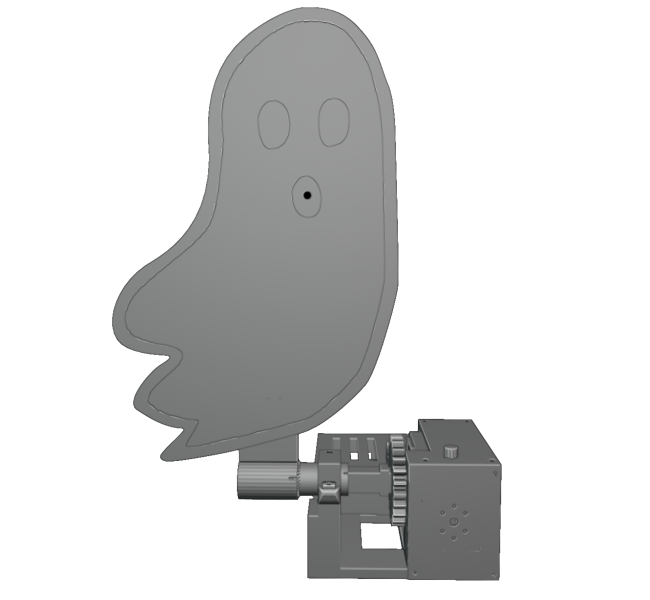
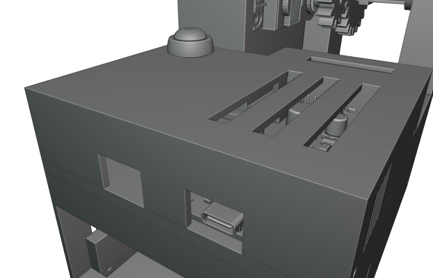
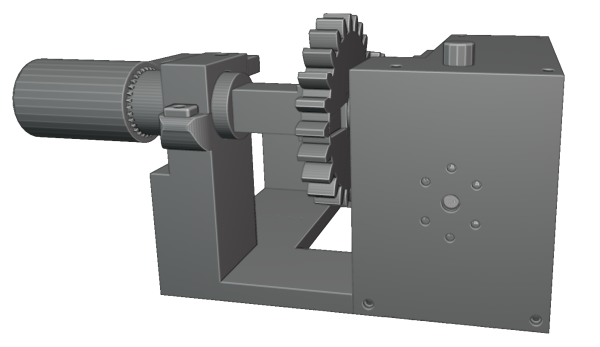
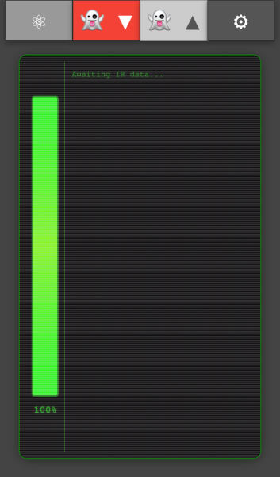
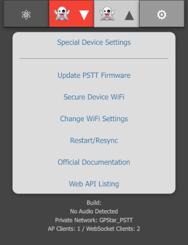
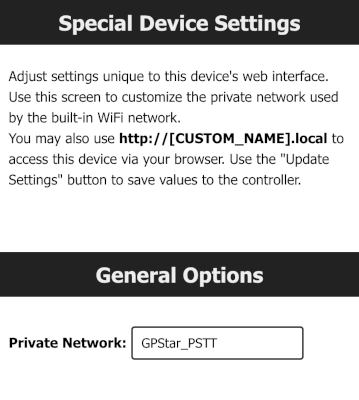
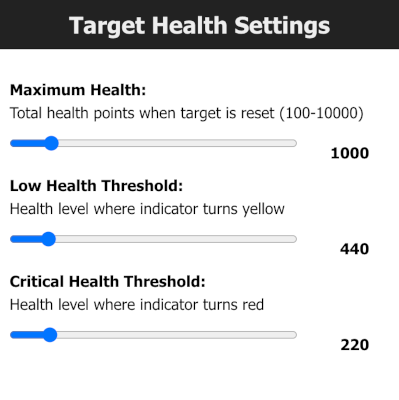
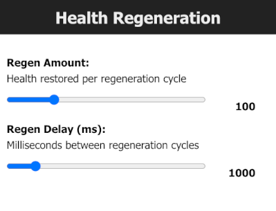
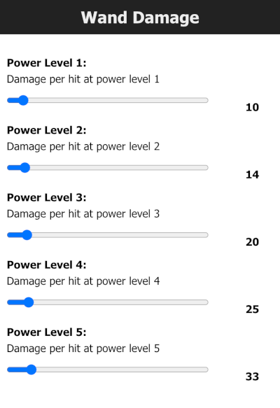
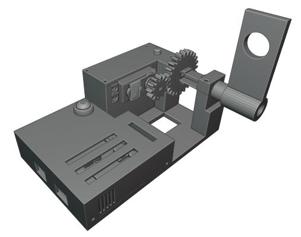

  <h2>
    
    GPStar Proton Stream Target Trainer Operational Guide  </h2>

# Information

The Proton Stream Target Trainer is a dedicated aiming and calibration platform designed for use with your Proton Pack system in controlled training environments. Featuring an integrated spectral target module—styled as a Class V apparition—the unit provides a clear visual reference for stream alignment and tracking drills. Its sensor array registers proton stream contact in real time, allowing operators to refine accuracy, maintain beam stability, and correct drift during sustained engagement.

## Assembly

Assembly instructions for the Proton Stream Target Trainer can be found in PDF format [here](/extras/GPStar%20PSTT%20Assembly%20Instructions.pdf?raw=true).

## Operating The System

A PDF version of this operation guide can be found [here](/extras/GPStar%20PSTT%20Operation%20Guide.pdf?raw=true).

### Power
Connect a 5V power source to the USB-C connector on the back of the Proton Stream Target Trainer to
power the system. 

When the system has power, the servo motor will move the target arm to the upright position and the LED
indicators will turn green.

Pressing the button on the back cover will lower the target. Holding the button will raise it.

### LED Indicators

There are two different LED indicators on the Proton Stream Target Trainer. When the target arm is in the
down position, both the top indicator and front indicator will be solid red. When the target arm is in the upright position, both will be green.

While firing at the target, when a successful hit has been registered, the top indicator will switch to blue. 

The front indicator will start flashing while the target is taking damage and then turn solid red  when the target has been defeated.

## WiFi Connectivity

To connect to the GPStar Proton Stream Target Trainer over WiFi, a private WiFi network (access point) will
appear as GPStar_PSTT and this will be secured with a default password of 555-2368. 

Once connected, your computer/phone/tablet will be assigned an IP address starting from 192.168.2.100
with a subnet of 255.255.255.0. Please remember that if you intended to have multiple devices connect
via this private WiFi network, you will be assigned a unique IP address for each client device (ex: phone,
tablet or computer). 

A web based user interface is available at http://gpstar_pstt.local or http://192.168.2.2 to view the state of your Proton Stream Target Trainer, in which you will be able to manage specific actions.

### Status

The equipment status will reflect the current
state of your Proton Stream Target Trainer. It
will update in real time while you are
interacting with the target.

- On the left, a vertical bar displays the
current health of the target.
- The main view shows the current status of
the target.
- It will display information such as how
much damage it just took, what type of
stream hit the target, when the target is
knocked over, etc.

### Lower Target

When the lower target button is red, clicking
on it will lower the target.

### Raise Target

When the raise target button is green,
clicking on it will raise the target.

### Preferences / Administration
The preferences and administration provide a interface for managing options. The settings are divided into several sections.

- Special Device Settings: Changing various settings of the Proton Stream Target Trainer.
- Update Firmware: Allows you to update the firmware using over the air updates.
- Secure Device WiFi: You can change the default password for the devices WiFi network.
- Change WiFi Settings: This provides an optional means of joining an existing, external WiFi network for access of your device.
- Restart / Re-sync: You can remote restate the software by performing a reboot of the device.

At the bottom of the screen is a timestamp representing the build date of the firmware, the current firmware version of your GPStar Audio if connected and the name of the private WiFi network offered by the current device. If connected to an external WiFi network, the current IP address and subnet mask will also be displayed.

### Special Device Settings
You can change the name of the WiFi network under General Options.

### Target Health Settings
These are settings related specifically to the health and strength of your ghost target. You can set the
Maximum Health, Low Health Threshold and Critical Health Threshold of the target.

### Health Regeneration Settings
The ghost target will automatically regenerate it’s health when it is not taking damage from your proton
stream. Here you can adjust how much health is regenerated at each cycle and also adjust the cycle delay between each health regeneration in milliseconds.

### Wand Damage
The amount of damage the target takes per hit can be adjusted per power level of the Proton Stream.

### WiFi Settings
It is possible to have your device join an existing WiFi network which may provide a more stable network
connection.

- Enable the external WiFi option and supply the
preferred WiFi network name (SSID) and WPA2
password for access.
- Optionally you may specify an IP Address, subnet
mask and gateway IP if you wish to use static
values. Otherwise the device will obtain these
values automatically from your chosen network via
DHCP.
- Save the changes. This will cause the device to reboot and attempt to connect to the network up to 3 tries.
- Return to the “Change WiFi Settings” section to
observe the IP address information. If the connection
was successful, an IP address, subnet mask and
gateway IP will be shown.
- While connected to the same WiFi network on your
phone / computer / tablet, use the IP address shown to connect to your device’s web interface. 

Use of an unsecured WiFi network is not supported or
supported.

## WiFi Password Reset
If you have forgotten the password to your GPStar Proton Stream Target Trainer WiFi network, you can
reset it by holding the button the top cover while the system is powering up.

Once reset, the default password will be 555-2368

## Increasing WiFi Performance
When using the WiFi in a crowded environment, such as a convention, the signal may become overwhelmed by competing RF devices. When possible, you can configure the Proton Stream Target Trainer to connect to a stronger more stable wireless network as a client rather than relying on the built-in access point. This may improve the range and performance.

- For Android devices offering a cellular hotspot, these devices may utilise a feature called Client
Isolation Mode. This will prevent hotspot clients from seeing each other. Unless you can disable this
option on a rooted device, you will not be able to reach the web UI from the hotspot network.
- For iOS devices offering a cellular hotspot, please make sure that the Maximise Compatibility option
is enabled. This will ensure your device offers a 2.4GHz radio and will be seen by the GPStar Proton
Stream Target Trainer.