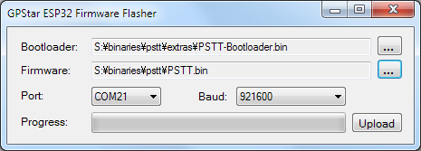

<center>
  <h2>
    <span class="logo-icon-tiny"></span>
    GPStar Proton Stream Target Trainer Operational Guide  </h2>
</center>


<div class="page-break"></div>

# Information

<div class="page-break"></div>

The Proton Stream Target Trainer is a dedicated aiming and calibration platform designed for use with your Proton Pack system in controlled training environments. Featuring an integrated spectral target module—styled as a Class V apparition—the unit provides a clear visual reference for stream alignment and tracking drills. Its sensor array registers proton stream contact in real time, allowing operators to refine accuracy, maintain beam stability, and correct drift during sustained engagement.

## Assembly

Assembly instructions for the Proton Stream Target Trainer can be found in PDF format [here](https://cdn.shopify.com/s/files/1/0772/0517/6651/files/GPStar_PSTT_Assembly_Instructions.pdf?v=1774010957).

## Firmware Flashing

### Standard Updates (via WiFi)

1. Power on the PSTT.
1. Open the WiFi preferences on your computer/device and look for the SSID which matches **"GPStar_PSTT"**.
    * If this is your first connection to this access point, use the default password **555-2368**.
1. Navigate directly to the URL: [http://gpstar_pstt.local/update](http://gpstar_pstt.local/update) or [http://192.168.2.2/update](http://192.168.2.2/update).
1. Use the "Select File" button and select the [PSTT.bin](/binaries/pstt/PSTT.bin?raw=true) file from the `/binaries/pstt` directory.
1. The upload will begin immediately. Once at 100% the device will reboot automatically.


**Note:** If the upload fails, this is not uncommon. Simply attempt the upload again using the OTA updater.

### Diagnostic Updates (via USB-C)

**Option 1: Using GPStar ESP32 Firmware Uploader**

This uses a purpose-built flash tool just like the tools for the Proton Pack, Neutrona Wand, Single-Shot Blaster and GPStar Audio. Thanks to its ease of use, this is our recommended method for performing the first-time USB upload process. For Windows users, download the ESP32 firmware flasher tool which is labelled for use with the GPStar II and Attenuator devices, available via the **Support & Downloads** page on the GPStar website.

[GPStar II / GPStar Attenuator Firmware Flasher](https://gpstartechnologies.com/pages/support-downloads)

> For Linux or macOS users, you will need to use one of the alternative options described below.

1. Plug your device into a USB port on your computer.
2. If not already downloaded from the Support & Downloads page above, locate the following files from the `/binaries/pstt` directory.

    * [extras/PSTT-Bootloader.bin](/binaries/pstt/extras/PSTT-Bootloader.bin?raw=true) = This is the standard bootloader for the PSTT.
    * [PSTT.bin](/binaries/pstt/PSTT.bin?raw=true) = This is the custom firmware for the PSTT.

3. Open the GPStar ESP32 Firmware Flasher and browse to the files specified in step 2 above for each of the requested file locations (see below screenshot).



4. The program should automatically detect the correct COM port and baud rate (see above screenshot). If it did not, use the drop-down menus to select the correct one for your PC.

5. Click the Upload button to flash the new firmware to your PSTT. Be patient, this process can take between 15 seconds and several minutes depending on the selected baud rate.

6. Once the flash has completed successfully, your PSTT should now be broadcasting a WiFi network.

**Option 2: Via Web Uploader**

This uses a 3rd-party website to upload using the Web Serial protocol which is only available on the Google Chrome, Microsoft Edge, and Opera desktop web browsers. Mobile browsers are NOT supported, and you will be prompted with a message if your web browser is not valid for use.

1. Plug your device into a USB port on your computer and go to [http://espwebtool.ghostbusters.engineering](http://espwebtool.ghostbusters.engineering) (which [redirects to https://esp.huhn.me](https://esp.huhn.me)).

1. Locate the following files from the `/binaries/pstt` directory.

    * [extras/PSTT-Bootloader.bin](/binaries/pstt/extras/PSTT-Bootloader.bin?raw=true) = This is the standard bootloader for the PSTT.
    * [extras/PSTT-Partitions.bin](/binaries/pstt/extras/PSTT-Partitions.bin?raw=true) = This specifies the partition scheme for the flash memory.
    * [extras/boot_app0.bin](/binaries/pstt/extras/boot_app0.bin?raw=true) = This is the software for selecting the available/next OTA partition.
    * [PSTT.bin](/binaries/pstt/PSTT.bin?raw=true) = This is the custom firmware for the PSTT.

1. Click on the **CONNECT** button and select your USB serial device from the list of options and click on "Connect".

1. Once connected, select the files (noted above) for the following address spaces:

    * `0x1000` &rarr; [PSTT-Bootloader.bin](/binaries/pstt/extras/PSTT-Bootloader.bin?raw=true)
    * `0x8000` &rarr; [PSTT-Partitions.bin](/binaries/pstt/extras/PSTT-Partitions.bin?raw=true)
    * `0xE000` &rarr; [boot_app0.bin](/binaries/pstt/extras/boot_app0.bin?raw=true)
    * `0x10000` &rarr; [PSTT.bin](/binaries/pstt/PSTT.bin?raw=true)

1. Click on the **PROGRAM** button to begin flashing. View the "Output" window to view progress of the flashing operation.

1. Once the device has completely flashed (100%) unplug the USB cable and remove any remaining power source from the device. Restore power to reboot the device and confirm operation.

View [a quick video](images/ESP_Firmware_Update.mp4) of what this process should look like. Your list of USB devices may differ, and it may require selecting a different device if you cannot immediately determine which connected device is your ESP32.

**Option 3: Via Command-Line**

You will need to utilize a command-line tool to upload the firmware to your device from your local computer. Note this is *not recommended* unless you are using a platform other than Windows or Mac OSX, such as Linux.

1. Install the latest Python 3.x utility based on your operating system:

    -  Windows: Download the installer from [Python](https://www.python.org/downloads/windows/). When installing you may be prompted to "Add Python to PATH", and it is recommended to accept that option.
    -  Linux: Execute `sudo apt update && sudo apt install -y python3 python3-pip`
    -  MacOS: Execute `brew install python` using Homebrew ([instructions here](https://brew.sh/))

1. From a terminal (command line) prompt run the following which will install the `pip` tool along with the `esptool` utility:

    ```
    python3 -m ensurepip
    python3 -m pip install --upgrade pip setuptools esptool
    ```

1. Confirm that python was installed successfully by running the commands `python --version` and `python3 --version`. Use the command that reports a 3.x version (`python` or `python3`) for all following steps. We will assume `python3` is available.

1. Navigate to the `binaries/stream` directory within the extracted GPStar-proton-pack software release:

    `cd <extracted_location>/binaries/pstt`

1. Run the following command to flash the bootloader and firmware:

    ```
    python3 -m esptool --port-filter vid=0x303A --chip esp32 --baud 921600 write-flash --flash-mode dio --flash-size detect --flash-freq 40m 0x1000 extras/PSTT-Bootloader.bin 0x8000 extras/PSTT-Partitions.bin 0xe000 extras/boot_app0.bin 0x10000 PSTT.bin
    ```

## Operating The System

A PDF version of this operation guide can be found [here](https://cdn.shopify.com/s/files/1/0772/0517/6651/files/GPStar_PSTT_Operation_Guide.pdf?v=1774399839).

### Power
Connect a 5V power source to the USB-C connector on the back of the Proton Stream Target Trainer to power the system. 


When the system has power, the servo motor will move the target arm to the upright position and the LED indicators will turn green.

Pressing the button on the back cover will lower the target. Holding the button will raise it.


### LED Indicators

There are two different LED indicators on the Proton Stream Target Trainer. When the target arm is in the down position, both the top indicator and front indicator will be solid red. When the target arm is in the upright position, both will be green.

While firing at the target, when a successful hit has been registered, the top indicator will switch to blue. 

The front indicator will start flashing while the target is taking damage and then turn solid red  when the target has been defeated.


## WiFi Connectivity

To connect to the GPStar Proton Stream Target Trainer over WiFi, a private WiFi network (access point) will appear as GPStar_PSTT and this will be secured with a default password of `555-2368`.

Once connected, your computer/phone/tablet will be assigned an IP address starting from 192.168.2.100 with a subnet of 255.255.255.0. Please remember that if you intended to have multiple devices connect via this private WiFi network, you will be assigned a unique IP address for each client device (ex: phone, tablet or computer).

A web based user interface is available at http://gpstar_pstt.local or http://192.168.2.2 to view the state of your Proton Stream Target Trainer, in which you will be able to manage specific actions.

### Status

The equipment status will reflect the current
state of your Proton Stream Target Trainer. It
will update in real time while you are
interacting with the target.

- On the left, a vertical bar displays the
current health of the target.
- The main view shows the current status of
the target.
- It will display information such as how
much damage it just took, what type of
stream hit the target, when the target is
knocked over, etc.


### Lower Target

When the lower target button is red, clicking
on it will lower the target.


### Raise Target

When the raise target button is green,
clicking on it will raise the target.


### Preferences / Administration
The preferences and administration provide a interface for managing options. The settings are divided into several sections.

- Special Device Settings: Changing various settings of the Proton Stream Target Trainer.
- Update Firmware: Allows you to update the firmware using over the air updates.
- Secure Device WiFi: You can change the default password for the devices WiFi network.
- Change WiFi Settings: This provides an optional means of joining an existing, external WiFi network for access of your device.
- Restart / Re-sync: You can remote restate the software by performing a reboot of the device.

At the bottom of the screen is a timestamp representing the build date of the firmware, the current firmware version of your GPStar Audio if connected and the name of the private WiFi network offered by the current device. If connected to an external WiFi network, the current IP address and subnet mask will also be displayed.


### Special Device Settings
You can change the name of the WiFi network under General Options.


### Target Health Settings
These are settings related specifically to the health and strength of your ghost target. You can set the
Maximum Health, Low Health Threshold and Critical Health Threshold of the target.


### Health Regeneration Settings
The ghost target will automatically regenerate it’s health when it is not taking damage from your proton
stream. Here you can adjust how much health is regenerated at each cycle and also adjust the cycle delay between each health regeneration in milliseconds.


### Wand Damage
The amount of damage the target takes per hit can be adjusted per power level of the Proton Stream.


### WiFi Settings
It is possible to have your device join an existing WiFi network which may provide a more stable network
connection.

- Enable the external WiFi option and supply the
preferred WiFi network name (SSID) and WPA2
password for access.
- Optionally you may specify an IP Address, subnet
mask and gateway IP if you wish to use static
values. Otherwise the device will obtain these
values automatically from your chosen network via
DHCP.
- Save the changes. This will cause the device to reboot and attempt to connect to the network up to 3 tries.
- Return to the “Change WiFi Settings” section to
observe the IP address information. If the connection
was successful, an IP address, subnet mask and
gateway IP will be shown.
- While connected to the same WiFi network on your
phone / computer / tablet, use the IP address shown to connect to your device’s web interface. 

Use of an unsecured WiFi network is not supported or
supported.


## WiFi Password Reset
If you have forgotten the password to your GPStar Proton Stream Target Trainer WiFi network, you can
reset it by holding the button the top cover while the system is powering up.

Once reset, the default password will be 555-2368


## Increasing WiFi Performance
When using the WiFi in a crowded environment, such as a convention, the signal may become overwhelmed by competing RF devices. When possible, you can configure the Proton Stream Target Trainer to connect to a stronger more stable wireless network as a client rather than relying on the built-in access point. This may improve the range and performance.

- For Android devices offering a cellular hotspot, these devices may utilise a feature called Client
Isolation Mode. This will prevent hotspot clients from seeing each other. Unless you can disable this
option on a rooted device, you will not be able to reach the web UI from the hotspot network.
- For iOS devices offering a cellular hotspot, please make sure that the Maximise Compatibility option
is enabled. This will ensure your device offers a 2.4GHz radio and will be seen by the GPStar Proton
Stream Target Trainer.

## Software Development Requirements

The development platform of choice for this device is [VSCode with PlatformIO](VSCODE.md). Please follow the linked guide for installing the core software and plugins required.