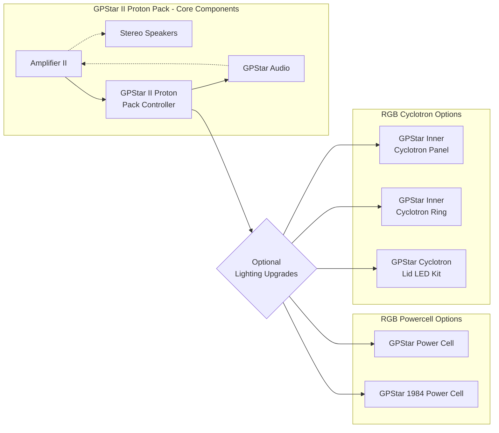
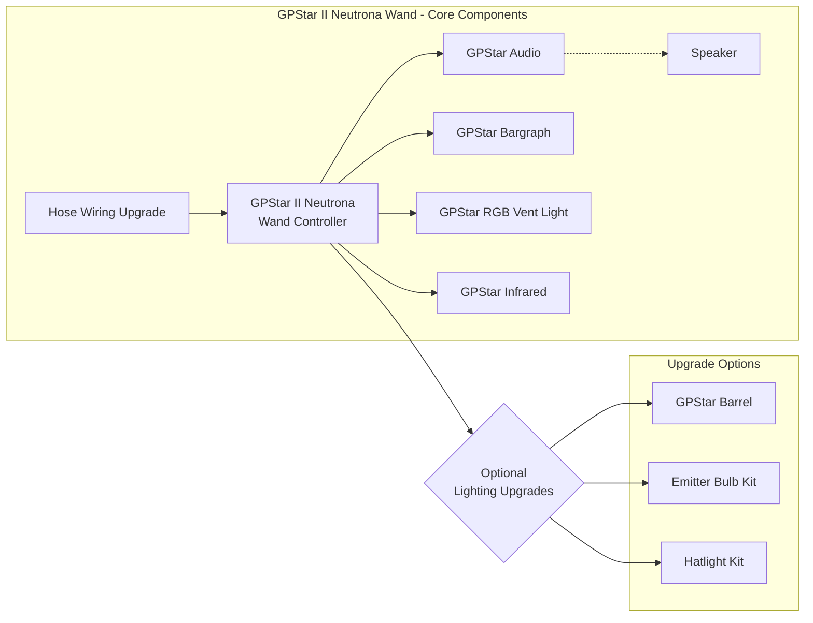

<h1> GPStar Documentation Home</h1>

For the Proton Pack, Neutrona Wand, and Accessories

# Summary

A fully integrated Proton Pack and Neutrona Wand, packed with features and add-ons. Compatible with the HasLab Plasma Series Proton Pack and Neutrona Wand, Mack's Proton Pack and Wand, and more!

## Key Features

The GPStar system is designed around two key features:

- Polyphonic Sound
    - Allows simultaneous playback of multiple audio tracks which can be layered together to create a rich experience with smoothly layered sound effects and buttery smooth transitions.
    - While blasting away with the Proton stream you can still hear all the layers of sound effects that came before...the Pack effects, each Wand toggle effect, Music etc.
- Full Wand/Pack Communication
     - By connecting both the pack and wand controllers with an upgraded hose and wiring, both devices work seamlessly together. Interactions with the wand have an immediate effect on the pack, and vice-versa.
     - This functionality includes sound effects, alarm triggers, Cyclotron interaction, venting/overheat sequences, and proton stream effects (eg. video game colours and crossing the streams).

## Upgrade Paths

The next generation is here! The latest version of equipment is named **GPStar II** and all kits are based around the latest generation controllers. You can view a comparison of the [original and newest controllers here](https://gpstartechnologies.com/blogs/gpstar-blog/gpstar-ii-vs-gpstar). See the [kit guide here](https://gpstartechnologies.com/blogs/gpstar-blog/gpstar-kit-guide) for more information about available kits with a quick view of the 2 primary upgrade paths shown below.

### GPStar II Lite

The **GPStar II Lite** kit is intended to provide a direct, plug-and-play upgrade to the stock controller in a Haslab-based Proton Pack ONLY. This allows your stock Spengler Series or 1984 Neutrona Wand to power up the Proton Pack just as the original pack supported. No upgrades to your hose or its wiring is necessary for this kit.

For clarity, this is not a "keepalive" or cheat device, it is a complete replacement of the stock controller and provides an always-on system that does not shut down nor require power-cycling the Proton Pack after a period of time. Please note that this does not alter the default timeout in the Neutrona Wand, which may still require re-activation when that occurs. For users starting with the basic **GPStar II Lite** system here's how you can begin and later expand your setup:

> <small>Mermaid Diagram - Upgrade Flowchart</small>

### GPStar II Pack+Wand

For a more comprehensive upgrade you will want to look at a full Proton Pack + Neutrona Wand kit which involves upgrading BOTH devices along with the wiring through the hose connection. Such kits are listed as the **GPStar II Basic**, **GPStar II Core**, or **GPStar II Extreme**, and are a full replacement of both stock controllers and also acts as an always-on system. The base components and upgrade path for the Proton Pack is identical to the **GPStar II Lite **kit listed above, but offers an immediate upgrade path for the Neutrona Wand.

> <small>Mermaid Diagram - Upgrade Flowchart</small>

## Feature Reel Demos

Just see for yourself what this kit can do, and you'll be ready to believe us!

## Walkthrough Videos

*"You know, it just occurred to me that we really haven't had a successful test of this equipment." -Ray Stantz*

Except that we have! Here is a [Walkthrough Video Contributed by JustinDustin](https://www.youtube.com/watch?v=mnfljGd5-uU) (YouTube, March 2023) showcasing several of the stock features in a converted pack/wand combination. Several optional features were implemented as part of this build using the Arduino platform.

Additionally, this video covers several new updates in the months since, using the new GPStar controllers, as the [Optional Features and Menu Walkthrough](https://www.youtube.com/watch?v=ePXz99UawLQ) (YouTube, July 2023).

## Guides Everywhere!

*"Ray, pretend for a moment that I don't know anything about metallurgy, engineering, or physics, and just tell me what the hell is going on." -Dr. Venkman*

That's alright, this will help you study. Start with [the Component Guides section](GUIDE_LISTING.md) to find the dedicated guides to build out your new electronic brains, and maybe find some cool new features to implement as part of the addendums.

## Movie-Accurate Audio

### About our Effects files

The sound effects files furnished with this project are combination of self made files to those contributed within the Ghostbusters community, etc. We do apologize if it is forgotten to acknowledge where some of the files originate from, though we do our best to share credit where due. See the [About](ABOUT.md) page for more information.

### "Yes, have some"...music!

Special thanks to Michael Klodzinksi for graciously allowing us to include his version of [Savin' The Day](https://www.youtube.com/watch?v=shJslMSAxE0) as a bundled music file to demo your awesome Proton Pack mods! Check out his other works at [michaelk.net](https://michaelk.net).

## Licensing

This program is free software: you can redistribute it and/or modify it under the terms of the GNU General Public License as published by the Free Software Foundation, either version 3 of the License, or (at your option) any later version.

This program is distributed in the hope that it will be useful, but WITHOUT ANY WARRANTY; without even the implied warranty of MERCHANTABILITY or FITNESS FOR A PARTICULAR PURPOSE. See the GNU General Public License for more details.

You should have received a copy of the GNU General Public License along with this program. If not, see <https://www.gnu.org/licenses/>.

## Disclaimer

This community-driven project is independent and not affiliated with, endorsed by, or sponsored by Hasbro Inc., Ghost Corps, or Sony Pictures. Hasbro Inc. does not endorse or support this project, and any views or opinions expressed within the project are those of the individual contributors and not necessarily those of Hasbro Inc.

 
 

Participants in this project should be aware that it is entirely separate from any official activities or initiatives of Hasbro Inc.. Any use of Hasbro Inc.'s name or its products within this project is purely for informative purposes and does not imply any form of partnership, endorsement, or association with Hasbro Inc.

 
 

Individuals involved in this project are responsible for their own actions, and Hasbro Inc. bears no responsibility for the content, decisions, or outcomes related to this community-driven effort.

 
 

By participating in this project, individuals acknowledge that it is an independent initiative and that Hasbro Inc. is not responsible for the project's development, management, or outcomes.

 
 

This disclaimer is subject to change, and individuals are encouraged to check for updates regularly.

