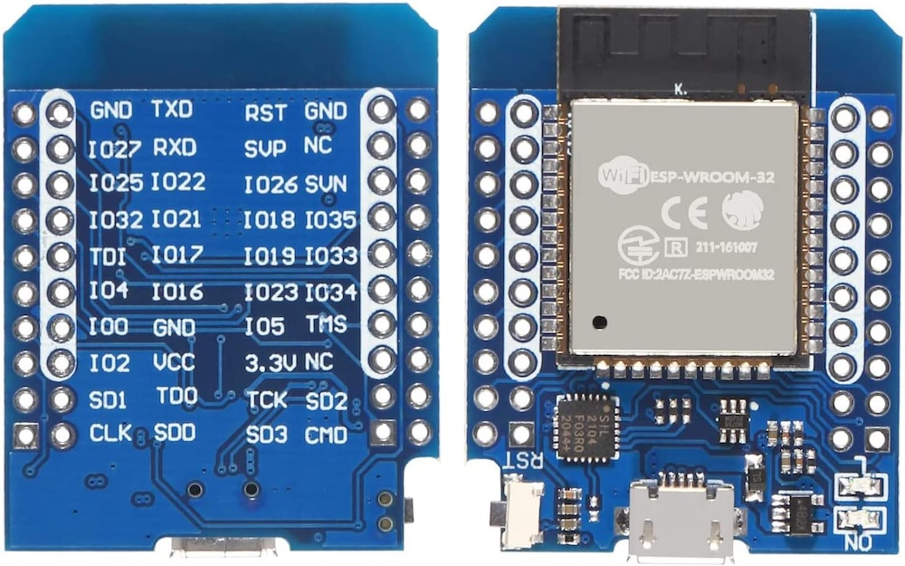

# Stream Effects

What good is a Proton Pack that doesn't throw a stream? This device aims to provide a true interactive experience with your Neutrona Wand by offering a light show of epic proportions, not unlike the spectacle of a giant Twinkie.

This depends on the presence of an Attenuator or WiFi Adapter in order to provide a wireless integration with your equipment.

Watch this demonstration of the Belt Gizmo and Stream Effects devices:
<video src="../videos/effects_demo.webm" controls width="480">
  Your browser does not support the video tag.
</video>

## External Shell

To help make your final device look more polished, a simple project enclosure is available to encapsulate your ESP32 Mini as will be used in this build.

- [ESP32 Mini Enclosure by Dustin Grau](https://www.tinkercad.com/things/39nAaTEvdFY-esp32-mini-enclosure?sharecode=MeckPb0Cxp0IQtvAr5UArlMZEFwcrhd_EKvVeLHaFFM)

## Bill of Materials

Assembly of this device WILL require SOLDERING skills and is considered a DIY approach at this time. The exact list of parts below were chosen for their availability from common sources and/or available support across the Internet.

* [ESP32 Mini Dev Board](https://a.co/d/dMZEs5r)
* [5M Round Reticulate RGB LED Rope Light](https://a.co/d/j8L33dh) [May be found cheaper from AliExpress]
* [270 ohm Resisitor](https://a.co/d/j5Otzhq)

## ESP32 - Pin Connections

The following is a diagram of the **ESP32-Mini pins** from left and right, when oriented with the USB connection facing down (south) AND from the underside, like the pinout diagram above-left. Note that this device has 2 rows of pins so it is best to orient to the view which has the silkscreened labels.

| Connection | ESP32 (R) |     | ESP32 (L) | Connection |
|------------|-----------|-----|-----------|------------|
| GND LED -  | GND   TXD |     | RST   GND |            |
|            | IO27  RXD |     | SVP    NC |            |
|            | IO25 IO22 |     | IO26  SVN |            |
|            | IO32 IO21 |     | IO18 IO35 |            |
|            | TDI  IO17 |     | IO19 IO33 |            |
| IO4 LEDs   | IO4  IO16 |     | IO23 IO34 |            |
|            | IO0   GND |     | IO5   TMS |            |
| VCC LED +  | IO2   VCC |     | 3.3V   NC |            |
|            | SD1   TD0 |     | TCK   SD2 |            |
|            | CLK   SD0 |     | SD3   CMD |            |
|            |         | **USB** |         |            |

This is a very simple connection scheme. We simply need to power the LEDs from the VCC and any GND ports on the chip, and connect the signal line to the IO4 pin with a 270 ohm resistor inline. This device can be powered by any USB battery bank via a Micro USB cable.

## Assembly

The STL file `stl/stream_effects_enclosure.stl` can be used to enclose the ESP32 while leaving the USB port accessible.

## Firmware Flashing

For the initial flashing of the firmware you can use a 3rd-party website to upload using the Web Serial protocol which is only available on the Google Chrome, Microsoft Edge, and Opera desktop web browsers. Mobile browsers are NOT supported, and you will be prompted with a message if your web browser is not valid for use.

1. Plug your device into a USB port on your computer and go to [http://espwebtool.ghostbusters.engineering](http://espwebtool.ghostbusters.engineering) (which [redirects to https://esp.huhn.me](https://esp.huhn.me)).

1. Locate the following files from the `/binaries/stream` directory.

	* [extras/StreamEffects-Bootloader.bin](https://github.com/gpstar81/GPStar-proton-pack/blob/main/binaries/stream/extras/StreamEffects-Bootloader.bin?raw=1) = This is the standard bootloader for the ESP32 itself.
	* [extras/StreamEffects-Partitions.bin](https://github.com/gpstar81/GPStar-proton-pack/blob/main/binaries/stream/extras/StreamEffects-Partitions.bin?raw=1) = This specifies the partition scheme for the flash memory.
	* [extras/boot_app0.bin](https://github.com/gpstar81/GPStar-proton-pack/blob/main/binaries/stream/extras/boot_app0.bin?raw=1) = This is the software for selecting the available/next OTA partition.
	* [StreamEffects.bin](https://github.com/gpstar81/GPStar-proton-pack/blob/main/binaries/stream/StreamEffects.bin?raw=1) = This is the custom firmware for the GPStar kit.

1. Click on the **CONNECT** button and select your USB serial device from the list of options and click on "Connect".

1. Once connected, select the files (noted above) for the following address spaces:

	* 0x1000 &rarr; [StreamEffects-Bootloader.bin](https://github.com/gpstar81/GPStar-proton-pack/blob/main/binaries/stream/extras/StreamEffects-Bootloader.bin?raw=1)
	* 0x8000 &rarr; [StreamEffects-Partitions.bin](https://github.com/gpstar81/GPStar-proton-pack/blob/main/binaries/stream/extras/StreamEffects-Partitions.bin?raw=1)
	* 0xE000 &rarr; [boot_app0.bin](https://github.com/gpstar81/GPStar-proton-pack/blob/main/binaries/stream/extras/boot_app0.bin?raw=1)
	* 0x10000 &rarr; [StreamEffects.bin](https://github.com/gpstar81/GPStar-proton-pack/blob/main/binaries/stream/StreamEffects.bin?raw=1)

1. Click on the **PROGRAM** button to begin flashing. View the "Output" window to view progress of the flashing operation.

1. Once the device has completely flashed (100%) unplug the USB cable and remove any remaining power source from the device. Restore power to reboot the device and confirm operation.

Once the device is flashed successfully via USB you can use the WiFi and web UI to perform future flashes using over-the-air (OTA) updates.

## Operation

Look for a WiFi network of "StreamEffects_0000" or similar and connect using the password `555-2368`. Open a web browser to the same name as the network name, for instance `http://streameffects_0000.local`.

**Security Notice**

This device uses a default password of `555-2368` and should be changed immediately. You also have the option of changing the SSID broadcast if desired.
