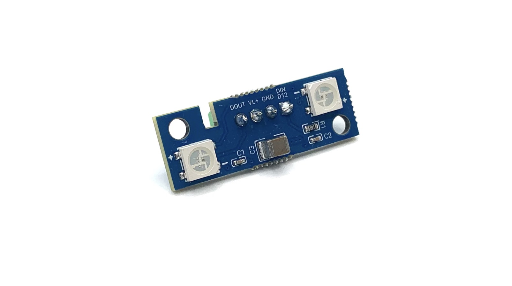
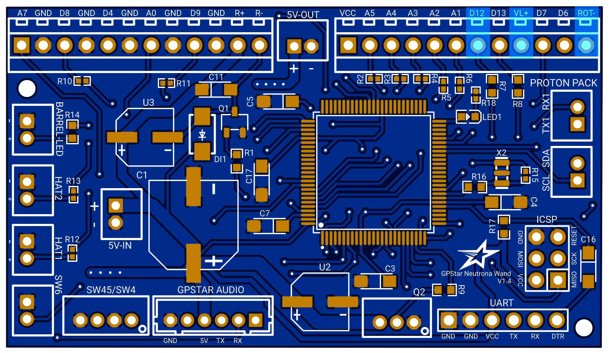
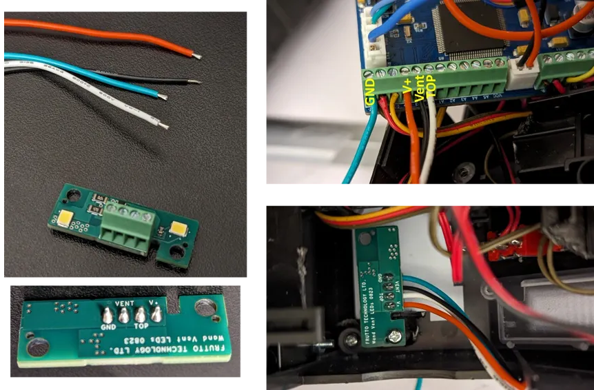

# GPStar RGB Vent Lights (Optional)

A colour changing vent light board that can be installed very easily with the GPStar Neutrona Wand PCB with no soldering required.

## Installation

Mount the board and wire the connections as indicated in the photo below. Note that the GND wire for the vent light board shares the same connection in the terminal blocks as the top dial ROT- terminal.

| Vent Light | Neutrona Wand |
|------------|---------------|
| VL+ | VL+  |
| D12 | D12  |
| GND | ROT- |

`After installation, you will need to enter the EEPROM Lighting Menu to enable the GPSTar RGB Vent Light. Please see the [EEPROM Configuration](OPERATION_EEPROM.md) guide.`

# Frutto Technology High Intensity Vent Lights

A brighter high intensity vent light from Frutto Technology can be installed very easily with the GPStar Neutrona Wand PCB with no soldering required.

## Installation

Mount the board and wire the connections as indicated in the photo below. Note that the GND wire for the vent light board shares the same connection in the terminal blocks as the top dial ROT- terminal. This circuit draws around 100mA, so that is why you need to provide the GND pin.

`WARNING: The light is very intense, do not look at it directly.`

`By default, the intensity of the Frutto Technology vent light is based on the power level and firing status of the wand. If you wish to disable this feature, please see the [Advanced Configuration](ADVCONFIG.md) guide.`

