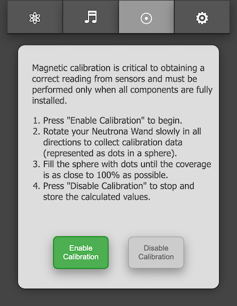
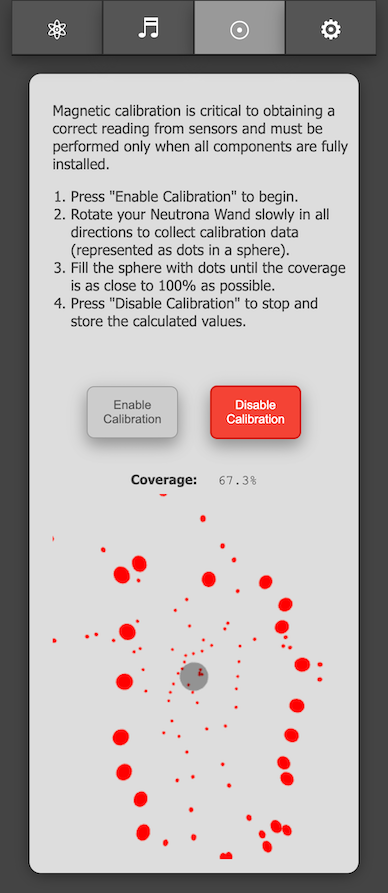

<h1> GPStar Neutrona Wand II  Magnetic Calibration</h1>

The GPStar Neturona Wand II is equipped with a gyroscope and magnetometer. The sensors can be even more finely calibrated to provide even more accurate data after it is fully installed into your Neutrona Wand.

To begin, connect to the WiFi on the GPStar Neutrona Wand II and click on the Calibration Menu icon at the top.

Then click on the Enable Calibration button.

The system will now will ask you to rotate your Neutrona Wand slowly in all directions. Visual calibaration monitor will appear on sceen to show your progress. Rotate your Neutrona Wand slowly to fill it with dots until the coverage is as close as 100%. 

When finished, click on the Disable Calibration button to save the newly calibration settings into the system memory.

