# GPStar II Wireless Operation

All devices within the GPStar ecosystem capable of operation over WiFi utilize a built-in web server which offers an API-first design for communications. This guide will cover the web interface available that is built into the GPStar Proton Pack II and GPStar Neutrona Wand II. As of the v6.1 firmware release all devices are now unified in naming and consistent with their private networking settings.

| Device Type | Default SSID | Default Password | IP Address |
|-------------|--------------|------------------|------------|
| Attenuator    | GPStar_Attenuator | 555-2368 | [192.168.1.2](http://192.168.1.2) |
| Proton Pack   | GPStar_Pack2      | 555-2368 | [192.168.1.4](http://192.168.1.4) |
| Neutrona Wand | GPStar_Wand2      | 555-2368 | [192.168.1.6](http://192.168.1.6) |

Automatic enabling or disabling of WiFi will take place in the following order:

1. **Attenuator > Pack**
	* When present, an Attenuator device will act as primary WiFi interface and the GPStar Proton Pack II will automatically disable its WiFi radio to conserve power.
	* WiFi access can be restored to the pack via the wand action menu (Level 3, Option 5, Barrel Wing Button).
2. **Pack > Wand**
	* When these devices are connected the GPStar Proton Pack II will serve as the primary WiFi interface and the GPStar Neutrona Wand II will automatically disable its WiFi radio to conserve power.
	* WiFi access can be restored to the wand via the wand action menu (Level 3, Option 5, Intensify).
3. **Wand**
	* For a standalone GPStar Neutrona Wand II or when not connected to a GPStar Proton Pack II, the WiFi will be enabled automatically.

## Proton Pack

If you have a Attenuator connected, the GPStar Proton Pack II will turn off its WiFi for power saving. You can manually turn on or turn off the WiFi for it from the [OPERATION_MENUS](OPERATION_MENUS.md)

To connect to the GPStar Proton Pack II over WiFi, a private WiFi network (access point) which will appear as **"GPStar_Pack2"**, and this will be secured with a default password of **555-2368**.

Once connected, your computer/phone/tablet should be assigned an IP address starting from **"192.168.1.100"** with a subnet of **"255.255.255.0"**. Please remember that if you intend to have multiple devices connect via this private WiFi network you will be assigned a unique IP address for each client device (eg. phone, tablet, or computer).

A web-based user interface is available at [http://gpstar_pack2.local](http://gpstar_pack2.local) or [http://192.168.1.4](http://192.168.1.4) to view the state of your Proton Pack and Neutrona Wand, and to manage specific actions. The available sections are described below.

#### Tab 1: Equipment Status

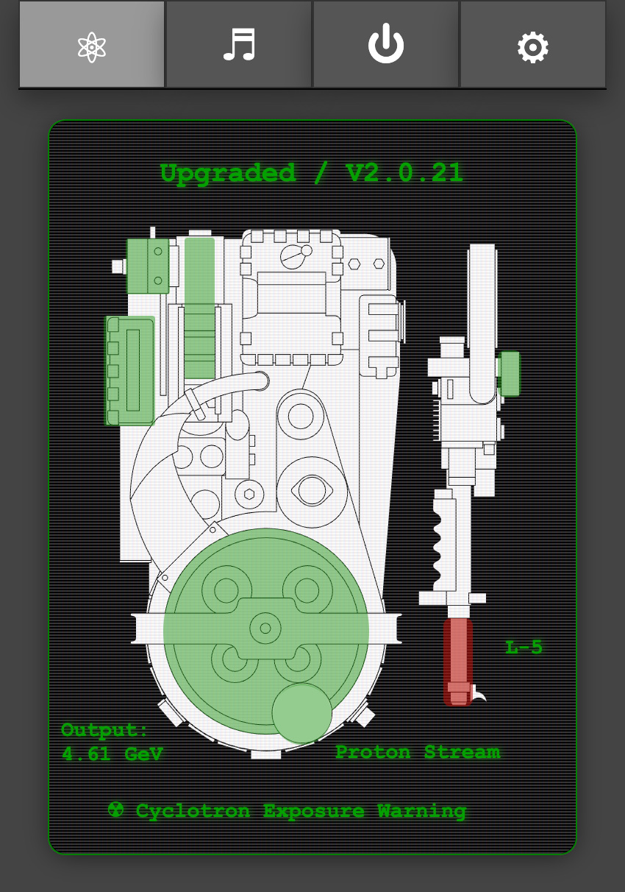

The equipment status will reflect the current state of your Proton Pack and Neutrona Wand and will update in real-time as you interact with those devices. This information is available as either a text-based or graphical display, or both if you prefer (set via Preferences).

When using the graphical display, most components of the Proton pack and Neutrona Wand are represented by colour-coded overlays on the component will may be affected by runtime actions:

- The top of the display will indicate the mode (Standard = Mode Original, Upgraded = Super Hero) along with the year theme (V1.9.8x or V2.0.2x).
- When the Ion Arm switch is engaged for Mode Original, the overlay for the Ion Arm will be green to indicate a ready state. When in Super Hero mode this overlay will be green when the Proton Pack is powered on.
- When the Proton Pack is powered on:
	- The Power Cell, Booster Tube, and Cyclotron overlays will be green as their default state.
	- When the Cyclotron is in a normal state the overlay will be green. It will change to yellow then red as it goes through the pre-warning and overheat states. During venting the overlay will be blue to indicate the recovery period.
	- The color state of the Booster Tube is linked to the "Output" text value which is the voltage measured at the Proton Pack PCB (in volts, but displayed as Gev). During high power draw events such as smoke generation the voltage can drop briefly, and will be reflected as a red overlay when that value is below 4.2V
- When the Neutrona Wand is powered on, the overlay above the Activate/Intensify portion of the gun box will indicate if the barrel is retracted (red) or extended (green).
- The current power level for the Neutrona Wand will be indicated by the "L-#" beside the barrel.
- The type of firing mode will be displayed below the Neutrona Wand and will be color coded via the barrel. Color intensity increases with the power level.
	- Proton Stream: Red (includes Spectral modes)
	- Plasm System: Green (incl. for 1989 theme)
	- Dark Matter Gen.: Blue
	- Particle System: Orange
	- Settings: Gray
- When using the power-detection feature with a stock Haslab Neutrona Wand the default stream will be Proton with a power level of 5. Instead of the stream type being displayed, there will be a wattage value displayed as Gigawatts (GW).
- If the Ribbon Cable is removed, a warning icon will appear over that component to indicate an alarm state.
- When the Cyclotron lid is removed a radiation exposure warning will be displayed at the bottom of the CRT display.

**Note:** When using the text-based display, if you see a "&mdash;" (dash) beside the labels it can indicate a potential communication issue. Simply refresh the page and/or check your WiFi connection to the device.

Special thanks and credit to fellow cosplayer [Alexander Hibbs (@BeaulieuDesigns87)](https://www.etsy.com/shop/BeaulieuDesigns87) from the [South Carolina Ghostbusters](https://www.facebook.com/SCGhostbusters/), who created the amazingly detailed Proton Pack and Neutrona Wand technical illustration, available as a [printed poster](https://www.etsy.com/listing/1406461576/proton-pack-blueprint-matte-poster) or [digital image](https://www.etsy.com/listing/1411559802/proton-pack-blueprint-digital-download). He has graciously provided a version of his design to make the new graphical interface.

#### Tab 2: Audio Controls

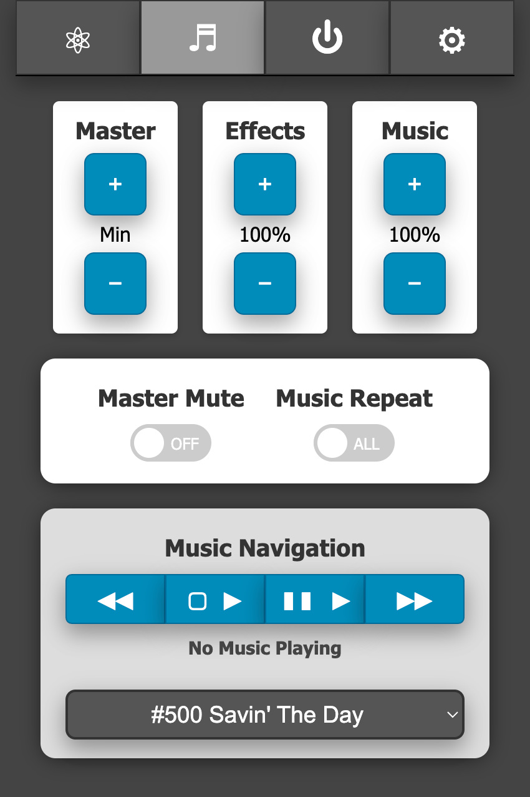

This section allows full control of the system (overall) volume, effects volume, and music volume along with the ability to mute/unmute all devices. The current volume levels will be shown and updated in real-time whether adjusted via the web UI, the pack, or the wand.

For playback of music you can use the improved navigation controls:

| Indicator | Track Action |
|-----------|--------------|
| &#9664;&#9664; | Previous |
| &#9634;&nbsp;&#9654; | Start/Stop |
| &#9646;&#9646;&nbsp;&#9654; | Pause/Resume |
| &#9654;&#9654; | Next/Skip |

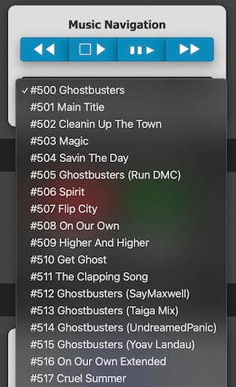

You may also jump directly to a specific track for playback via the selection field (switching immediately if already playing, otherwise that track will be started via the Start/Stop button).

By default, only the track numbers are known to the audio device as all music tracks must begin at value "500" per the naming convention used by the GPStar controller software. However it is possible to add a track listing to the device's memory so that user-friendly song names can be displayed. See the Special Device Settings Section described below for more information.

#### Tab 3: Pack Controls

Controls will be made available on a per-action or per-state basis.

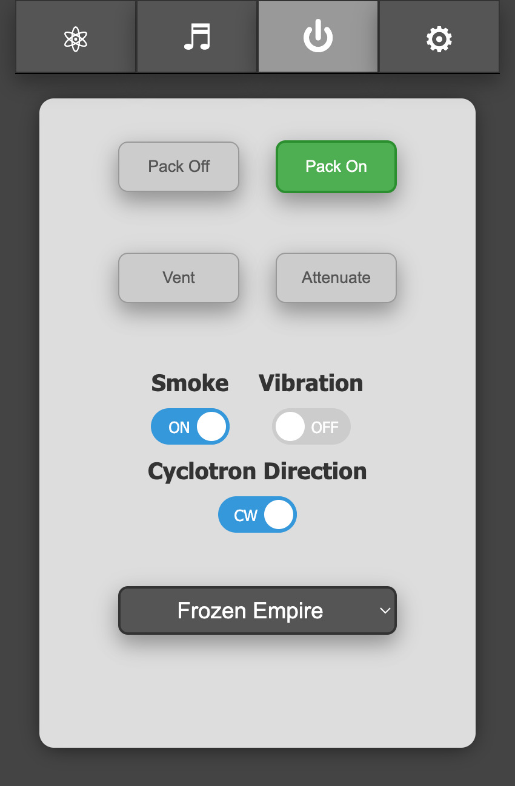

Shown here, the pack and wand are both in an Idle state while in the "Super Hero" operation mode which allows the pack to be turned on/off remotely. The options to remotely vent or to "Attenuate" are only enabled when the devices are in a specific state.

**Vent:** This can only be triggered remotely when in the "Super Hero" mode and while the Pack State is "Powered".

**Attenuate:** When firing, the Cyclotron State must be either "Warning" or "Critical" to enable this button.

**Smoke:** Enable or disable smoke effects.

**Vibration:** Enable or disable Proton Pack vibration.

**Cyclotron Rotation Direction:** Set your cyclotron rotation from clockwise or counter clockwise.

**Theme:** Set the theme mode of your Proton Pack between: 1984, 1989, Afterlife or Frozen Empire.

**Stream:** Change the stream type as you would using the top-dial directly on the Neutrona Wand.

#### Tab 4: Preferences / Administration

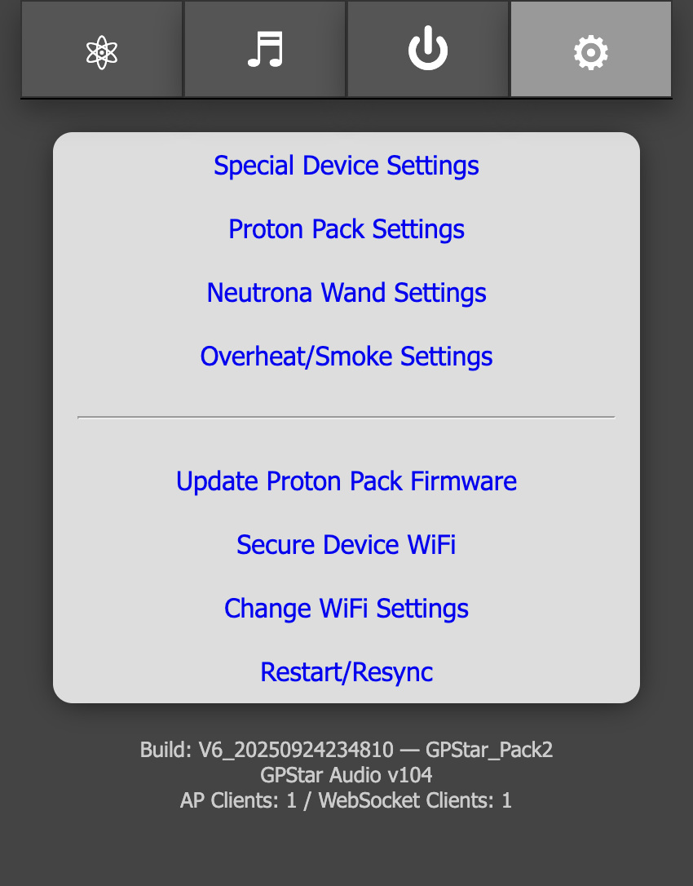

These provide a web interface for managing options which are accessed via the LED or Config EEPROM menus. The settings are divided into 4 sections: Special Device Settings, Proton Pack, Neutrona Wand, and Overheat/Smoke. The features available via these sections will be covered in-depth later in this document.

These links allow you to change or control aspects of the available devices in lieu of the EEPROM menu.

- **Update Firmware** - Allows you to update the firmware using Over-the-Air updates. See the [FLASHING](FLASHING.md) guide for details
- **Secure Device WiFi**- Allows changing of the default password for the private WiFi network
- **Change WiFi Settings** - Provides an optional means of joining an existing, external WiFi network for access of your device
- **Restart/Resync** - Allows a remote restart of the software by performing a reboot ONLY of the device

At the bottom of the screen is a timestamp representing the date of the software build for the firmware, the current GPStar Audio Firmware version, along with the name of the private WiFi network offered by the current device. If connected to an external WiFi network the current IP address and subnet mask will be displayed.

### Special Proton Pack Device Settings

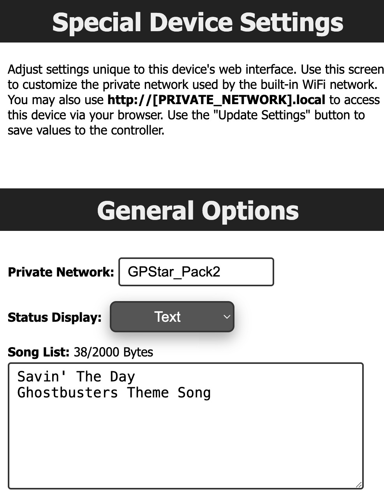

The special device settings allows you to change the graphical user interface, change the private network name and adding track names to music.

### Proton Pack Settings

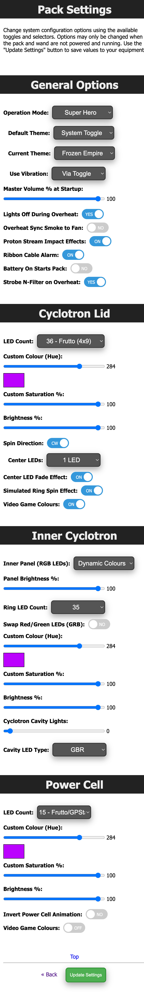

Set options related specifically to the Proton Pack. Options such as the color/saturation sliders will only take effect if you have installed upgrades to the RGB Power Cell and Cyclotron lid light kits. Similarly, the Video Game mode option will have no effect on the stock Haslab LEDs.

**Reminder:** The ability to update settings or save to EEPROM will be disabled so long as the pack and wand are running. Turn off all physical toggles to set these devices to an idle state before adjusting settings. Refresh the page to get the latest values for preferences.

📝 **Note:** When changing options such as the count of LEDs in use for a device, or some options such as the Operation Mode, a full power-cycle of the equipment is required after saving to EEPROM.

### Neutrona Wand Settings

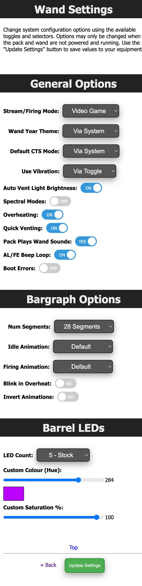

Set options related specifically to the Neutrona Wand. These can be accessed from the GPStar Proton Pack II, or by connecting to the GPStar Neutrona Wand II directly over WiFi.

**Reminder:** The ability to update settings or save to EEPROM will be disabled so long as the pack and wand are running. Turn off all physical toggles to set these devices to an idle state before adjusting settings. Refresh the page to get the latest values for preferences.

📝 **Note:** When changing options such as the count of LEDs in use for a device, a full power-cycle of the equipment is required after saving to EEPROM.

### Overheat/Smoke Settings

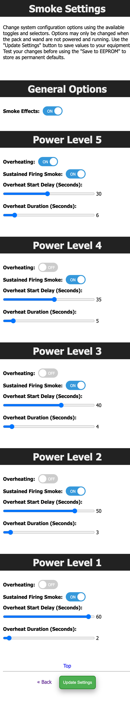

Adjust overall smoke effects (toggle on/off) and adjust per-level effects. Naturally, these options will have no effect on operation without a smoke kit installed.

**Reminder:** The ability to update settings or save to EEPROM will be disabled so long as the pack and wand are running. Turn off all physical toggles to set these devices to an idle state before adjusting settings. Refresh the page to get the latest values for preferences.

### External WiFi Settings

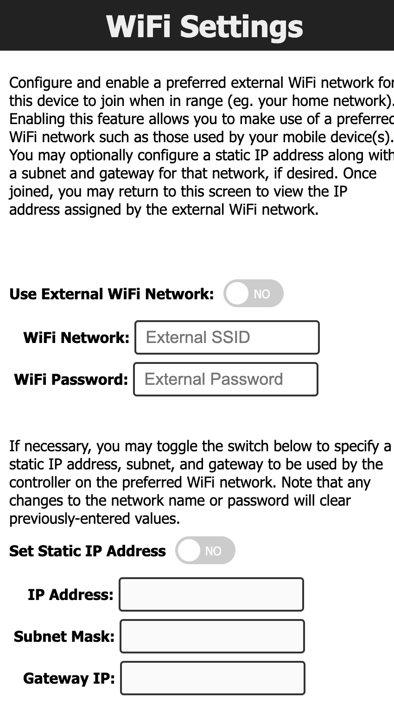

It is possible to have your device join an existing WiFi network which may provide a more stable network connection.

1. Access the "Change WiFi Settings" page to make the necessary device modifications.
1. Enable the external WiFi options and supply the preferred WiFi network name (SSID) and WPA2 password for access.
	- Optionally, you may specify an IP address, subnet mask, and gateway IP if you wish to use static values. Otherwise, the device will obtain these values automatically from your chosen network via DHCP.
1. Save the changes, which will cause the device to reboot and attempt to connect to the network (up to 3 tries).
1. Return to the "Change WiFi Settings" section to observe the IP address information. If the connection was successful, an IP address, subnet mask, and gateway IP will be shown.
1. While connected to the same WiFi network on your computer/phone/tablet, use the IP address shown to connect to your device's web interface.

Use of an unsecured WiFi network is not supported and not recommended.

## Neutrona Wand

The WiFi on the GPStar Neutrona Wand II is disabled for power saving measures when it is connected to a GPStar Proton Pack II. You can manually turn on or turn off the WiFi for the GPStar Neutrona Wand II from the [OPERATION_MENUS](OPERATION_MENUS.md)

When a GPStar Neutrona II is connected to a GPStar Proton Pack II, all the Neutrona Wand settings can be accessed from the GPStar Proton Pack II. 

To connect to the GPStar Neutrona Wand II over WiFi, a private WiFi network (access point) which will appear as **"GPStar_Wand2"**, and this will be secured with a default password of **"555-2368"**.

Once connected, your computer/phone/tablet should be assigned an IP address starting from **"192.168.1.100"** with a subnet of **"255.255.255.0"**. Please remember that if you intend to have multiple devices connect via this private WiFi network you will be assigned a unique IP address for each client device (eg. phone, tablet, or computer).

A web-based user interface is available at [http://gpstar_wand2.local](http://gpstar_wand2.local) or [http://192.168.1.6](http://192.168.1.6) to view the state of your Neutrona Wand, and to manage specific actions. The available sections are described below.

#### Tab 1: Neutrona Wand Status

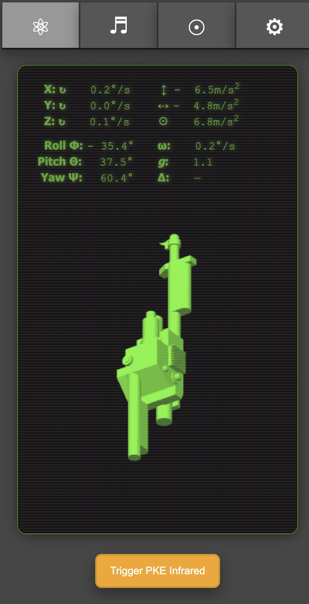

The Neutrona Wand status screen will display the real time rotational coordinates and other sensor data in real time. Moving your Neutrona Wand up, down, and or rotating will automatically update visually on screen. Two buttons at the bottom of the screen allow you to re-centre the 3D representation of your Neutrona Wand and also to trigger a Infrared Signal if you have a GPStar Infrared sensor attached to your Neutrona Wand.

#### Tab 2: Audio Controls

The same as seen in the Audio Controls in the Proton Pack settings above.

#### Tab 3: Sensor Calibration

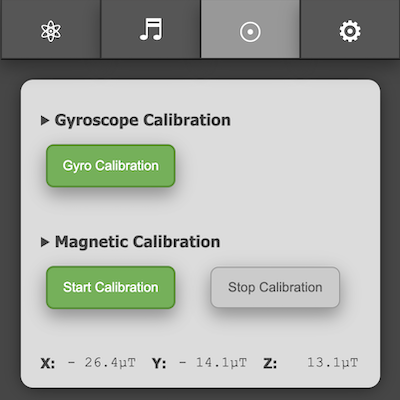

The GPStar Neturona Wand II is equipped with a gyroscope and magnetometer. The sensors can be even more finely calibrated to provide more accurate data after it is fully installed into your Neutrona Wand, taking into account nearby magnetic sources such as a speaker.

You can begin a sensor calibration by pressing the Enable Calibration button. You will then start relatively slowly rotating your Neutrona Wand in all directions. A visual calibration monitor will appear on screen to show your progress. Rotate the Neutrona Wand to fill in the dots until the coverage is as close as possible to 100%. 

**TIP: Point the Neutrona Wand down, and slowly raise it up in an arc. Turn slightly and then arc back to full down. Repeat this process until you have done a 360.**

Press the Disable Calibration button when you are finished to save the newly calibrated settings into the system memory.

**Note:** You must have at least 60% coverage in order for the calibration data to be effective! If you exit the calibration process before reaching 60% you will be given a confirmation to either continue collecting data or stop the process and no calibration values will be calculated.

See the [WAND_CALIBRATION](WAND_CALIBRATION.md) for more details.

#### Tab 4: Preferences / Administration

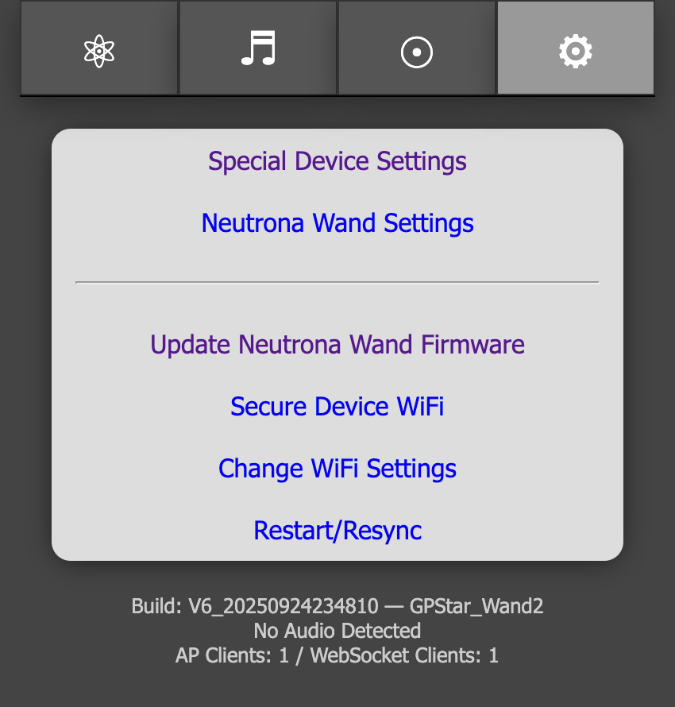

These provide a web interface for managing options which are accessed via the LED or Config EEPROM menus. The settings are divided into 4 sections: Special Device Settings, Neutrona Wand Settings.

These links allow you to change or control aspects of the available devices in lieu of the EEPROM menu.

- **Update Firmware** - Allows you to update the firmware using Over-the-Air updates. See the [FLASHING](FLASHING.md) guide for details
- **Secure Device WiFi**- Allows changing of the default password for the private WiFi network
- **Change WiFi Settings** - Provides an optional means of joining an existing, external WiFi network for access of your device
- **Restart/Resync** - Allows a remote restart of the software by performing a reboot ONLY of the device

At the bottom of the screen is a timestamp representing the date of the software build for the firmware, the current GPStar Audio Firmware version, along with the name of the private WiFi network offered by the current device. If connected to an external WiFi network the current IP address and subnet mask will be displayed.

### Special Neutrona Wand Device Settings

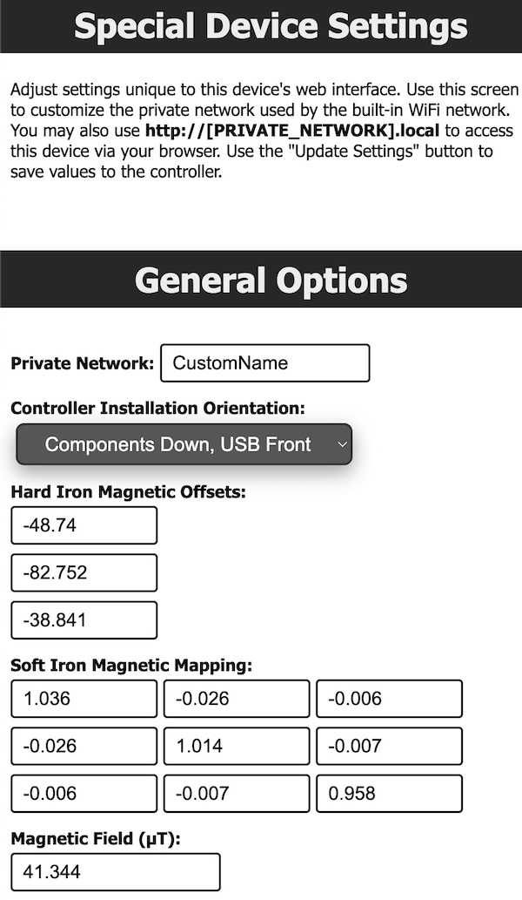

In the Special Device Settings for the Neutrona Wand, you can customize the name of the private wireless network when WiFi is enabled for the device.

The purpose of the Controller Installation Orientation Menu option is to establish the correct X, Y, and Z directions for the sensors relative to how the GPStar Neutrona Wand II board is installed inside your Neutrona Wand body. For example, on Hasbro Neutrona Wands it will be "Components Down, USB Front"; for a Mack's Factory Neutrona Wand, it will be in a different orientation such as the "Components Right, USB front".

The magnetic offset information it editable but not recommended to do so unless you understand the purpose. The display of "Hard Iron" (magnetic corrections) and "Soft Iron" (nearby metallic interference) can be used to verify that calibration of the device produced unique values to your Neutrona Wand device. These will be applied automatically to sensor readings to ensure consistent and stable behavior.

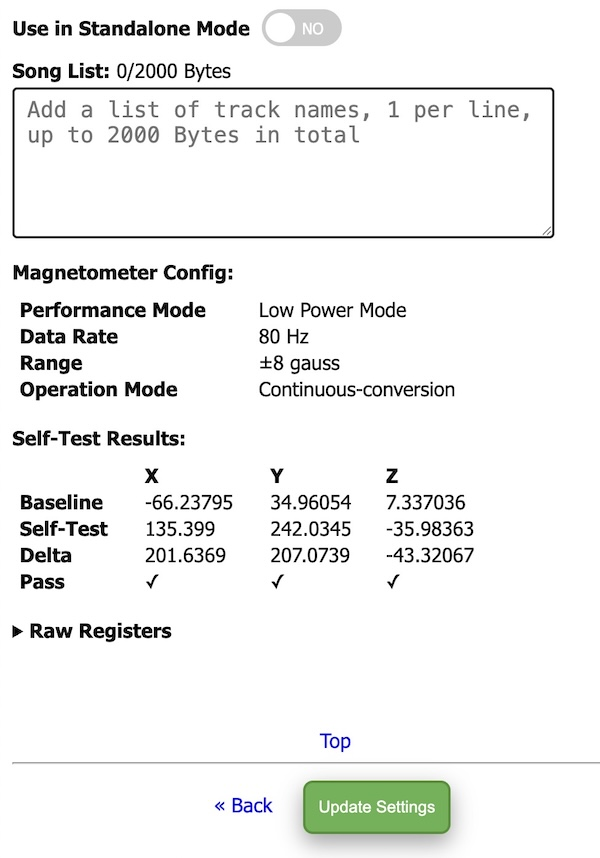

A toggle to enable or disable Standalone Mode for the Neutrona Wand is available, which makes testing of features more user-friendly during installation. When enabled, no communication will occur with the Proton Pack even if properly attached. **Be sure to disable this option for normal use or you will find that the Neutrona Wand will not control the Proton Pack as expected!**

Lastly, you can configure the music track names for the GPStar Neutrona Wand II in stand-alone mode **Using it without a GPStar Proton Pack II**.

**Note:** Diagnostic information related to the magnetometer is shown for troubleshooting purposes. This can be disregarded for normal use.

### Neutrona Wand Settings

The same as seen in the Neutrona Wand settings accessed from the Proton Pack above.

## WiFi Password Reset

If you have forgotten the password to your GPStar Proton Pack II or GPStar Neutrona Wand II private WiFi network, you can reset the password via the action menu level 3 in the Neutrona Wand.

See the [OPERATION_MENUS](OPERATION_MENUS.md) for more details.

Once reset, the default password will be **555-2368**

## Increasing WiFi Performance

It should be clearly stated that the WiFi built into these boards are a low-power device. When used in a crowded (read: convention) environment the signal may become overwhelmed by competing RF devices. When possible, configure the device to connect to a stronger, stable wireless network as a client rather than relying on the built-in access point as this may improve the range and performance of the web-based interface.

- For **Android** devices offering a cellular hotspot, these devices may utilize a feature called "Client Isolation Mode" which will prevent hotspot clients from seeing each other. Unless you can disable this option (via a rooted device) you will not be able to reach the web UI via the hotspot network.
- For **iOS** devices offering a cellular hotspot, please make sure that the "Maximize Compatibility" option is enabled. This will ensure your device offers the 2.4GHz radio and will be seen by the GPStar Proton Pack II or GPStar Neutrona Wand II.
