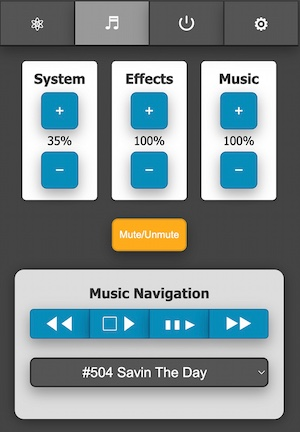
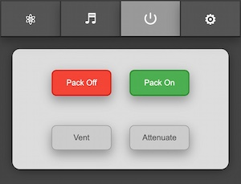
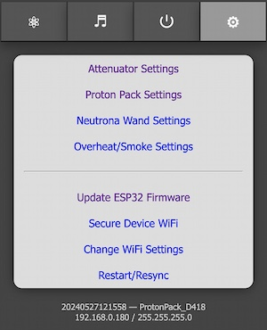
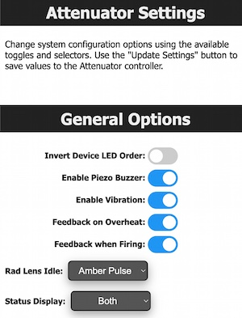
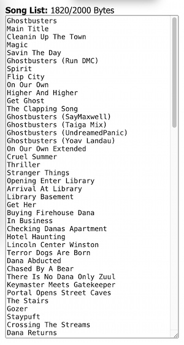

# Attenuator Wireless Operation

All devices within the GPStar ecosystem capable of operation over WiFi utilize a built-in web server which offers an API-first design for communications. This guide specifically covers the interactions as will be available to the Attenuator or legacy Wireless Adapter.

## Requirements

Before proceeding, it is worth noting that these wireless devices are only capable of operating on the 2.4GHz band for WiFi communications. While it does support the 801.11b/g/n networking standards, any computer/phone/tablet which connects to this device via external WiFi network, or will be connected via the private WiFi network on this device as a client, must support the 2.4GHz band. For secured networks, only the WPA2 standard is allowed (joining an open networks is not supported nor advised).

Connectivity options include either a private WiFi network from the device, and the ability to join an external WiFi network. For the latter this may be your home network or a cellular hotspot, though this is subject to some factors which are environmental or vendor-specific.

## WiFi Limitations

It should be clearly stated that these are low-power consumer device and will not have the same range and features as a true wireless access point. When used at home or a controlled environment it should respond in a satisfactory manner. Though when used in a crowded (read: convention) environment the signal may become lost or overwhelmed by competing RF devices. When possible, configure the device to connect to a stronger, stable wireless network as a client rather than relying on the built-in access point as this may improve the range and performance of the web-based interface.

- For **Android** devices offering a cellular hotspot, these devices may utilize a feature called "Client Isolation Mode" which will prevent hotspot clients from seeing each other. Unless you can disable this option (via a rooted device) you will not be able to reach the web UI via the hotspot network.
- For **iOS** devices offering a cellular hotspot, please make sure that the "Maximize Compatibility" option is enabled. This will ensure your device offers the 2.4GHz radio and will be seen by the device.

## WiFi Debug Mode

If you have forgotten the password to your device's private WiFi network, you can load the special `Attenuator-Reset.bin` firmware by following the ["Forgot Your WiFi Password" section of the ATTENUATOR_FLASHING guide](https://github.com/gpstar81/GPStar-proton-pack/blob/main/blob/main/ATTENUATOR_FLASHING.md#forgot-your-wifi-password).

As of the 5.2.2 firmware release a special debug option is available when using the hardware as an Attenuator, or if a momentary switch is installed between pin D4 and GND on the WiFi add-on controller. While powering on the device, push down on the main dial on the Attenuator (or press the momentary switch), and the device will bypass any stored password for local WiFi. This will reset the WiFi password for the built-in WiFi network, allowing the you to log back into the device and change to a suitable password. This should **only be done as a last resort** to regain access to the device if the password is forgotten or another technical issue may be preventing access!

## Firmware Flashing

Please see the [ATTENUATOR_FLASHING](ATTENUATOR_FLASHING.md) guide for details on compiling and/or uploading software to your Wireless Adapter controller.

## Hardware Synchronization

In order to view the state of the pack and control it remotely, the Proton Pack and Attenuator or WiFi add-on devices must be physically connected and have been sychnronized via the built-in software. On the WiFi Add-on device, there are 2 on-board LEDs which will show the current status:

- The onboard red LED indicates the device is powered and should be accessible via the private WiFi network.
- A second onboard LED will be lit blue to indicate when the device has successfully synchronized with the Proton Pack.

Additionally, when using the device as an Attenuator, the top most LED on that device will be lit as purple until pack synchronization has completed. If using the "standalone" firmware the top LED will remain lit as red.

## Web Interface

The Attenuator or Wireless Adapter will offer a default, private WiFi network (access point) which begins with the pattern **"ProtonPack_####"** where the #### is unique to each devices's WiFi network interface, and this will be secured with a default password of **"555-2368"**. Alternatively, the device may simply appear as **"GPStar_Attenuator"** in later firmware releases.

Once connected, your computer/phone/table should be assigned an IP address starting from **"192.168.1.100"** with a subnet of **"255.255.255.0"**. Please remember that if you intend to have multiple Attenuator/Wireless devices connect via this private WiFi network you will be assigned a unique IP address for each client device (eg. phone, tablet, or computer).

A web-based user interface is available at [http://192.168.1.2](http://192.168.1.2) to view the state of your Proton Pack and Neutrona Wand, and to manage specific actions. The available sections are described below.

**Note:** As of the latest 5.3.x release a new mDNS feature allows the device to respond to a localized name regardless of the WiFi network. In your browser simply navigate to `http://<SSID>.local` where the "SSID" is the same name as the private access point. This SSID is now user-customizable using the "Attenuator Settings" page shown below.

### Tab 1: Equipment Status

The equipment status will reflect the current state of your Proton Pack and Neutrona Wand and will update in real-time as you interact with those devices. This information is available as either a text-based or graphical display, or both if you prefer (set via Attenuator Preferences).

When using the graphical display, most components of the Proton pack and Neutrona Wand are represented by color-coded overlays on the component will may be affected by runtime actions:

- The top of the display will indicate the mode (Standard = Mode Original, Upgraded = Super Hero) along with the year theme (V1.9.8x or V2.0.2x).
- When the Ion Arm switch is engaged for Mode Original, the overlay for the Ion Arm will be green to indicate a ready state. When in Super Hero mode this overlay will be green when the Proton Pack is powered on.
- When the Proton Pack is powered on:
	- The Power Cell, Booster Tube, and Cyclotron overlays will be green as their default state.
	- When the Cyclotron is in a normal state the overlay will be green. It will change to yellow then red as it goes through the pre-warning and overheat states. During venting the overlay will be blue to indicate the recovery period.
	- The color state of the Booster Tube is linked to the "Output" text value which is the voltage measured at the Proton Pack PCB (in volts, but displayed as Gev). During high power draw events such as smoke generation the voltage can drop briefly, and will be reflected as a red overlay when that value is below 4.2V
- When the Neutrona Wand is powered on, the overlay above the Activate/Intensify portion of the gun box will indicate if the barrel is retracted (red) or extended (green).
- The current power level for the Neutrona Wand will be indicated by the "L-#" beside the barrel.
- The type of firing mode will be displayed below the Neutrona Wand and will be color coded via the barrel. Color intensity increases with the power level.
	- Proton Stream: Red (includes Spectral modes)
	- Plasm System: Green (incl. for 1989 theme)
	- Dark Matter Gen.: Blue
	- Particle System: Orange
	- Settings: Gray
- When using the power-detection feature with a stock Haslab Neutrona Wand the default stream will be Proton with a power level of 5. Instead of the stream type being displayed, there will be a wattage value displayed as Gigawatts (GW).
- If the Ribbon Cable is removed, a warning icon will appear over that component to indicate an alarm state.
- When the Cyclotron lid is removed a radiation exposure warning will be displayed at the bottom of the CRT display.

**Note:** When using the text-based display, if you see a "&mdash;" (dash) beside the labels it can indicate a potential communication issue. Simply refresh the page and/or check your WiFi connection to the device. In rare cases you may need to do a reboot of the device via the admin tab.

Special thanks and credit to fellow cosplayer [Alexander Hibbs (@BeaulieuDesigns87)](https://www.etsy.com/shop/BeaulieuDesigns87) from the [South Carolina Ghostbusters](https://www.facebook.com/SCGhostbusters/), who created the amazingly detailed Proton Pack and Neutrona Wand technical illustration, available as a [printed poster](https://www.etsy.com/listing/1406461576/proton-pack-blueprint-matte-poster) or [digital image](https://www.etsy.com/listing/1411559802/proton-pack-blueprint-digital-download). He has graciously provided a version of his design to make the new graphical interface.

### Tab 2: Audio Controls

This section allows full control of the system (overall) volume, effects volume, and music volume along with the ability to mute/unmute all devices. The current volume levels will be shown and updated in real-time whether adjusted via the web UI, the pack, or the wand.

For playback of music you can use the improved navigation controls:

| Indicator | Track Action |
|-----------|--------------|
| &#9664;&#9664; | Previous |
| &#9634;&nbsp;&#9654; | Start/Stop |
| &#9646;&#9646;&nbsp;&#9654; | Pause/Resume |
| &#9654;&#9654; | Next/Skip |

You may also jump directly to a specific track for playback via the selection field (switching immediately if already playing, otherwise that track will be started via the Start/Stop button).

By default, only the track numbers are known to the audio device as all music tracks must begin at value "500" per the naming convention used by the GPStar controller software. However, as of the 5.x release it is possible to add a track listing to the device's memory so that user-friendly song names can be displayed. See the Attenuator Settings described below for more information.

### Tab 3: Pack Controls

Controls will be made available on a per-action or per-state basis.

Shown here, the pack and wand are both in an Idle state while in the "Super Hero" operation mode which allows the pack to be turned on/off remotely. The options to remotely vent or to "Attenuate" are only enabled when the devices are in a specific state.

**Vent:** This can only be triggered remotely when in the "Super Hero" mode and while the Pack State is "Powered".

**Attenuate:** When firing, the Cyclotron State must be either "Warning" or "Critical" to enable this button.

### Tab 4: Preferences / Administration

These provide a web interface for managing options which are accessed via the LED or Config EEPROM menus. The settings are divided into 3 sections: Pack, Wand, and Smoke. The features available via these sections will be covered in-depth later in this document.

These links allow you to change or control aspects of the available devices in lieu of the EEPROM menu.

- **Update Firmware** - Allows you to update the firmware using Over-the-Air updates. See the [ATTENUATOR_FLASHING](ATTENUATOR_FLASHING.md) guide for details
- **Secure Device WiFi**- Allows changing of the default password for the private WiFi network
- **Change WiFi Settings** - Provides an optional means of joining an existing, external WiFi network for access of your device
- **Restart/Resync** - Allows a remote restart of the software by performing a reboot ONLY of the device

At the bottom of the screen is a timestamp representing the date of the software build for the device firmware, along with the name of the private WiFi network offered by the current device. If connected to an external WiFi network the current IP address and subnet mask will be displayed.

## Attenuator Settings

Set options related specifically to the Attenuator, such as when the vibration motor or buzzer may be used to provide physical feedback during operation.

**Note:** If you installed the Frutto Technology electronics into your DIY or GPStar Attenuator shell and found that the top and lower LEDs are displaying the wrong colors, you can use the "Invert" option to put the 3 lights into the correct order.

**NEW in 5.x** - The ability to add a user-friendly track listing has been integrated into the UI. Song titles may be entered as 1 entry per line, in the order by which they are numbered on your microSD card. The text is limited by bytes (max 2,000) not the number of lines, so to fit more entries into this text box you may need to use shorter song titles. This list of songs will be matched to each track number (starting from "500_" per the required numbering scheme). This data is stored only within the device and is only visible/used by the track selection field in the Music Navigation area.

## Pack Settings

Set options related specifically to the Proton Pack. Options such as the color/saturation sliders will only take effect if you have installed upgrades to the RGB Power Cell and Cyclotron lid light kits. Similarly, the Video Game mode option will have no effect on the stock Haslab LEDs.

**Reminder:** The ability to update settings or save to EEPROM will be disabled so long as the pack and wand are running. Turn off all physical toggles to set these devices to an idle state before adjusting settings. Refresh the page to get the latest values for preferences.

📝 **Note:** When changing options such as the count of LEDs in use for a device, or some options such as the Operation Mode, a full power-cycle of the equipment is required after saving to EEPROM.

## Wand Settings

Set options related specifically to the Neutrona Wand.

**Reminder:** The ability to update settings or save to EEPROM will be disabled so long as the pack and wand are running. Turn off all physical toggles to set these devices to an idle state before adjusting settings. Refresh the page to get the latest values for preferences.

📝 **Note:** When changing options such as the count of LEDs in use for a device, a full power-cycle of the equipment is required after saving to EEPROM.

## Overheat/Smoke Settings

Adjust overall smoke effects (toggle on/off) and adjust per-level effects. Naturally, these options will have no effect on operation without a smoke kit installed.

**Reminder:** The ability to update settings or save to EEPROM will be disabled so long as the pack and wand are running. Turn off all physical toggles to set these devices to an idle state before adjusting settings. Refresh the page to get the latest values for preferences.

## External WiFi Settings

It is possible to have your device join an existing WiFi network which may provide a more stable network connection.

1. Access the "Change WiFi Settings" page via [http://192.168.1.2/network](http://192.168.1.2/network) URL to make the necessary device modifications.
1. Enable the external WiFi options and supply the preferred WiFi network name (SSID) and WPA2 password for access.
	- Optionally, you may specify an IP address, subnet mask, and gateway IP if you wish to use static values. Otherwise, the device will obtain these values automatically from your chosen network via DHCP.
1. Save the changes, which will cause the device to reboot and attempt to connect to the network (up to 3 tries).
1. Return to the URL above to observe the IP address information. If the connection was successful, an IP address, subnet mask, and gateway IP will be shown.
1. While connected to the same WiFi network on your computer/phone/tablet, use the IP address shown to connect to your device's web interface.

Use of an unsecured WiFi network is not supported and not recommended.
